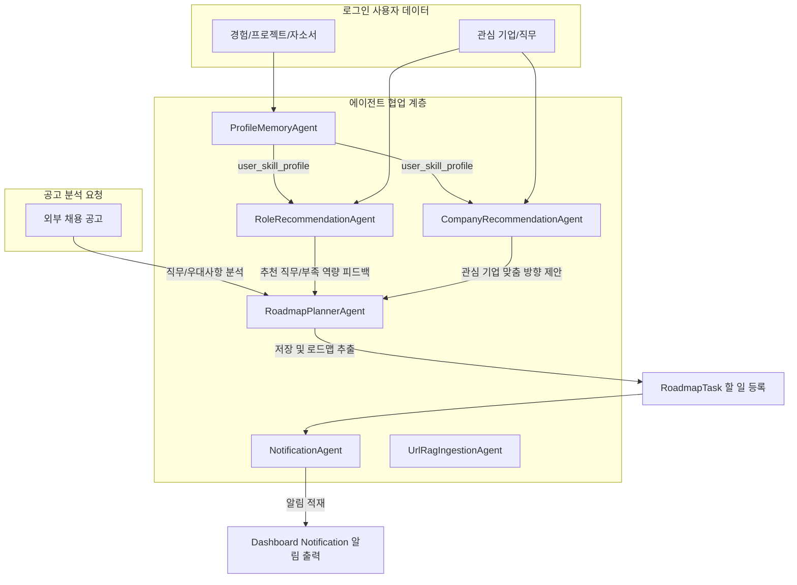

# Agent Workflow Design

이 문서는 JobFit Roadmap Agent 시스템의 현재 LangGraph 워크플로우 아키텍처를 진단하고, 향후 다중 에이전트(Multi-Agent) 환경으로 확장하기 위한 확장 에이전트 구조 및 제어 흐름에 대해 정의한다.

---

## 1. 현재 Agent 구조 (Current Single-Agent Pipeline)

현재 시스템은 단일 `JopFitState` 상태 컨텍스트를 기반으로 `StateGraph`에 적재된 아래 노드들을 순차 순회(Pipeline)하여 일회성 매칭 및 로드맵 리포트를 빌드한다.

```
validate_input -> analyze_job -> analyze_profile -> retrieve_skill_docs -> analyze_fit_gap -> retrieve_project_templates -> generate_roadmap -> check_risks -> format_final_result
```

* **입력 검증 및 정제**: `validate_input`을 통해 필수 파라미터 무결성을 검사한다.
* **텍스트 처리 및 RAG 매칭**: `retrieve_skill_docs`와 `retrieve_project_templates`에서 로컬 기술 사전 데이터를 단순 문자열 유사도로 검색 매칭하여 결합한다.
* **분석 및 리스크 점검**: `analyze_fit_gap`과 `generate_roadmap`에서 실제 LLM(OpenAI) 또는 캐시 데이터(Mock) 모드를 실행하며, `check_risks` 정규식 모듈로 작성 위험을 평가한다.

---

## 2. 확장 Agent 구조 (Extended Multi-Agent Architecture)

로그인 기능 및 경험 CRUD 데이터베이스가 마련되면, 단일 선형 워크플로우를 분할하여 독립적인 책임과 역할을 지닌 협력형 다중 에이전트(Multi-Agent) 형태로 확장 설계한다.

새롭게 도입되는 확장 에이전트는 다음과 같다.
1. **ProfileMemoryAgent**: 사용자 경험 통합 프로파일링 에이전트
2. **RoleRecommendationAgent**: 직무 추천 및 격차 분석 에이전트
3. **CompanyRecommendationAgent**: 관심 기업 매칭 및 방향성 가이드 에이전트
4. **RoadmapPlannerAgent**: 주차별 일감(Task) 상세 스케줄링 에이전트
5. **NotificationAgent**: 사용자 마일스톤 리마인더 및 알림 전송 에이전트
6. **UrlRagIngestionAgent**: 채용공고 RAG 소스 크롤링 및 청킹 에이전트

---

## 3. Agent별 역할 및 입출력 명세

### 3.1 ProfileMemoryAgent
* **역할**: 사용자가 수시로 수정/추가하는 이력 데이터들을 분석해 구조화된 핵심 보유 역량 프로필을 주기적으로 갱신한다.
* **입력**: `experiences` (경력 데이터), `projects` (수행 프로젝트), `resume_drafts` (자소서 파편)
* **처리**: 기술 역량 태그 추출, 실무 수준(초/중/고급) 평가, 이력 데이터 요약 구조화.
* **출력**: `user_skill_profile` (구조화된 핵심 역량 프로필 데이터)

### 3.2 RoleRecommendationAgent
* **역할**: 사용자의 통합 프로필과 희망 직무 정보를 활용하여 가장 승산이 높은 타깃 직무 후보군을 추천한다.
* **입력**: `user_skill_profile`, `preferred_roles` (관심 직무 목록), `analysis_histories` (이전 분석 기록)
* **처리**: 역량 매칭 점수 산출, 추천 가중치 부가, 부족한 보완 역량 갭 검출.
* **출력**: 추천 직무 목록, 추천 근거, 보완 역량 리스트.

### 3.3 CompanyRecommendationAgent
* **역할**: 사용자의 성향 및 보유 기술을 바탕으로 관심 기업 또는 추천 기업군별 타깃팅 전략을 제안한다.
* **입력**: `user_skill_profile`, `preferred_companies` (관심 기업 목록), `preferred_industry` (목표 산업군)
* **처리**: 관심 기업별 자격 요건 결합 분석, 기업별 핵심 컬처 핏(인재상) 융합.
* **출력**: 추천 기업 유형, 관심 기업별 준비 방향 가이드.

### 3.4 RoadmapPlannerAgent
* **역할**: 분석 단계에서 생성된 큰 줄기의 추천 프로젝트 로드맵 데이터를 데이터베이스 일감 스키마에 즉시 매핑될 수 있는 세부 태스크(RoadmapTasks)로 재설계한다.
* **입력**: Fit-Gap 결과 리포트, 목표 직무, 관심 기업, 희망 준비 기간.
* **처리**: 마일스톤 주간 작업 분배, 가용 시간에 비례한 태스크 난이도 평탄화(Leveling).
* **출력**: `roadmap` (로드맵 마스터), `weekly_tasks` (일감 태스크 목록).

### 3.5 NotificationAgent
* **역할**: 로드맵 태스크 진행 상황 및 미완료 일정에 대한 알림 트리거를 검출하여 메시지를 생산한다.
* **입력**: `roadmaps` (현재 가동 중인 로드맵), `roadmap_tasks` (작업 상세), `analysis_histories`
* **처리**: 작업 마감일(due_date) 임박 여부 계산, 자소서 갱신 알림 트리거.
* **출력**: `notification_message` (앱 내부 알림 저장 객체).

### 3.6 UrlRagIngestionAgent
* **역할**: 사용자가 제공한 URL 링크 및 본문 텍스트를 정제 및 분할하여 RAG 인덱스에 적재한다.
* **입력**: 공고 URL 링크 또는 외부 텍스트 원문.
* **처리**: HTML 태그 정제, 불필요 광고/푸터 스크랩 제거, 텍스트 Chunking 및 PostgreSQL DB 적재.
* **출력**: `rag_source`, `rag_chunks` 데이터베이스 엔티티.

---

## 4. 확장 에이전트 협력 흐름 (Mermaid Workflow)

아래 다이어그램은 데이터베이스 데이터를 토대로 각 에이전트들이 상호작용하여 최종 알림과 일감(Task)을 대시보드에 뿌리기까지의 데이터 파이프라인 흐름이다. (노드 색상을 배제한 순수 Mermaid flowchart)



---

## 5. Mock / LLM 실행 분기 및 가동 방식

* **기본 UI 시연 (Mock 모드)**:
  * 백엔드 API 및 전체 다중 에이전트 시나리오는 여전히 API 키 없이 시연이 가능하도록 설계한다.
  * `ProfileMemoryAgent`와 `RoleRecommendationAgent` 등은 Mock 가동 시, 준비된 모의 프로필 태그와 직무 매칭 결과를 정적으로 반환하여 대시보드를 즉시 시뮬레이션한다.
* **개발자 LLM 모드**:
  * 실제 OpenAI API 키가 주입되어 활성화되는 조건 하에 실제 GPT API를 이용한 동적 프롬프트 파이프라인이 가동된다.
  * 추천 에이전트 그룹은 과도한 LLM 비용 낭비를 제어하기 위해 1차적으로 DB에 구조화된 매칭 규칙(Rule-based)을 거친 뒤, 심층 정성적 보완 전략 제안 단계에서만 LLM을 Optional하게 호출하도록 스케줄러를 설계한다.

---

## 6. 향후 LangGraph 통합 방안

1. **기존 직무 매칭 그래프 분리**:
   * 기존의 공고 기반 직무 매칭과 Fit-Gap 리포트를 생성하는 `JopFitState` 그래프는 현재 상태를 그대로 안정적으로 유지한다.
2. **추천 워크플로우 그래프 신설**:
   * 직무/기업 추천 가이드 및 프로파일링 메모리를 관리하는 별도의 `RecommendationGraph`를 추가하여 두 그래프 간의 복잡성을 차단한다.
3. **알림 전송 백그라운드 태스크 분리**:
   * 대시보드 할 일 알림 발송 및 RAG 문서 청크 분할 연산은 HTTP 통신 밖으로 격리하여 Celery 등의 비동기 백그라운드 잡(Background Job)으로 실행한다.
