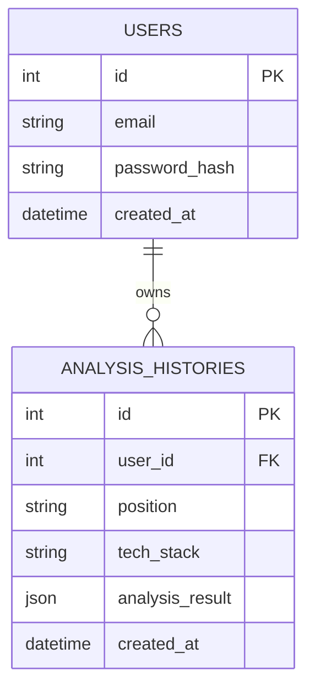

# ARCHITECTURE.md

# JopFit Roadmap Agent 시스템 아키텍처 정의서

이 문서는 JopFit Roadmap Agent MVP의 시스템 설계 방향성, 개별 모듈별 역할 정의, 주요 실행 모드 및 설계 의사결정 사유를 기술한다.

> **이 문서를 기준으로 향후 코드를 수정한다.**

---

## 1. 전체 시스템 목적 (System Goals)
JopFit Roadmap Agent는 취업 준비생과 이직 준비자를 위해 **채용공고 기반 직무 Fit-Gap 분석**과 **개인 맞춤형 프로젝트/학습 로드맵**을 제공하는 AI 에이전트 서비스다. 채용공고에서 도출된 핵심 요구 역량과 사용자의 이력 사항을 대조하여, 객관적인 역량 매칭 상태를 산출하고 이를 보완하기 위한 주차별 실천 프로젝트 시나리오를 설계하여 제공한다.

---

## 2. MVP 범위 및 구현 영역 (MVP Scope)

### 2.1 포함 기능 (In-Scope)
* **Streamlit 기반 UI**: 한 화면 내에서 입출력을 직관적으로 처리할 수 있는 반응형 프론트엔드 인터페이스 제공.
* **Fit-Gap 정량 정성 매칭**: 직무 요구사항별로 적합 등급(Strong Fit, Partial Fit, Gap)을 판정하고 세부 보완 행동을 매칭함.
* **근거 증빙 충족 비율 (Evidence Coverage Rate)**: 공고의 요구조건 대비 지원자의 서류에서 명시적으로 확인 가능한 원문 문구가 포함된 비율 계산.
* **주차별 마일스톤 설계**: 준비 기간(4주, 6주, 8주)과 가용 시간에 비례하는 상세 주간 개발/학습 로드맵 도출.
* **RAG 기반 직무/템플릿 검색**: Markdown으로 작성된 데이터 사전을 로드하여 단순 키워드로 직무 가이드라인 및 프로젝트 기본 템플릿을 연동.
* **이력서 리스크 진단**: 개인정보 노출(이메일, 휴대폰 번호, 주민등록번호) 검출 및 로드맵의 미래 계획이 이미 완료된 것처럼 작성된 모호한 완료형 진술 탐색.
* **분석 결과 보존**: 최종 분석 결과를 JSON 구조의 텍스트 파일로 내보낼 수 있는 다운로드 기능.

### 2.2 제외 기능 (Out-of-Scope)
프로젝트의 과대 확장을 예방하기 위해 아래 기능은 본 MVP에서 절대로 구현하지 않는다.
* 로그인 및 회원가입 기능 (세션 기반 일회성 수행)
* 외부 채용 사이트 자동 크롤링 (텍스트 본문 복사-붙여넣기 방식 대체)
* PDF 및 HWP 파일의 파싱/업로드 엔진 (직접 입력 대체)
* 영속성을 갖춘 데이터베이스 서버 연동
* Google Calendar 등 캘린더 일정 연동 및 내보내기
* 실제 A2A(Agent to Agent) 멀티에이전트 네트워크 및 MCP 서버 구축
* 합격 가능성 예측 모듈
* 유료 결제 게이트웨이 및 결제 시스템

---

## 3. 모듈별 역할 및 책임 (Module Responsibilities)

| Module / Path | Responsibility (책임 및 역할) |
| :--- | :--- |
| **[app.py](file:///C:/project/app.py)** | **프론트엔드 UI/UX**: 입력 폼 렌더링, API 키 수집, `graph.py`의 진입 함수 호출, 에러 발생 시 크래시 방지 및 시각화, JSON 다운로드 실행 및 결과 렌더링. |
| **[src/schemas.py](file:///C:/project/src/schemas.py)** | **데이터 검증 및 명세**: 서비스 내부 및 API 전달을 위한 데이터의 속성과 타입을 규정하는 Pydantic 모델 모음. |
| **[src/graph.py](file:///C:/project/src/graph.py)** | **워크플로우 제어**: `langgraph.graph.StateGraph`를 빌드 및 컴파일하며, 각 워크플로우 분기 노드와 공통 노드들의 데이터 처리 프로세스를 흐름에 따라 순차 실행. |
| **[src/llm.py](file:///C:/project/src/llm.py)** | **OpenAI API 핸들러**: OpenAI `ChatOpenAI` 인스턴스 구축, JSON 코드 블록 추출 및 디코딩, JSON 파싱 에러 발생 시 자가 교정 프롬프트 활용 1회 재시도. |
| **[src/rag.py](file:///C:/project/src/src/rag.py)** | **경량 RAG 검색 엔진**: `docs/` 폴더 내 Markdown 문서를 파싱하여 쿼리 단어들과의 키워드 매칭 스코어링 및 스니펫을 추출하는 단순 RAG 로직. |
| **[src/risk_checker.py](file:///C:/project/src/risk_checker.py)** | **서류 위험 검증**: 정규식 패턴을 통한 개인정보 필터링 및 로드맵 주간 상세 내역의 완료 어조 필터링. |
| **[src/sample_data.py](file:///C:/project/src/sample_data.py)** | **시연용 데이터 공급**: `USE_MOCK=true` 실행 조건 하에서 OpenAI API 호출 없이 기본 데모 시나리오를 시연할 수 있도록 구조화된 JopFitResult 모의 인스턴스 리턴. |
| **[src/prompts.py](file:///C:/project/src/prompts.py)** | **프롬프트 관리**: LLM이 반환해야 할 출력의 제약조건과 출력 JSON 스키마 구조를 통제하는 시스템 프롬프트 모음. |
| **[docs/](file:///C:/project/docs/)** | **외부 기술 사전**: RAG 검색에서 참조하여 아웃풋 세부 사항 및 주차별 가이드에 활용하는 직무/기술 지식 기반 Markdown 문서 저장소. |

---

## 4. 모드 설계 (Mock Mode vs LLM Mode)

JopFit Roadmap Agent는 개발 편의성과 확장성을 위해 동일한 `StateGraph` 구조 위에서 모드를 스위칭하여 동작한다.

1. **Mock 모드 (`USE_MOCK=true`)**
   * OpenAI API를 전혀 호출하지 않으므로 API 키가 필요 없다.
   * `src/sample_data.py`를 활용해 채용공고 핵심 추출 및 Fit-Gap, 로드맵 마일스톤 결과를 고정 모의 생성하며 RAG 검색 및 Risk Check 노드는 로컬 코드로 공통 동작한다.
2. **LLM 모드 (`USE_MOCK=false`)**
   * 사용자가 입력한 고유의 정보와 공고를 반영하기 위해 실제 OpenAI API를 호출하여 동작한다.
   * Pydantic 스키마 검증 절차 및 Self-Correction 재시도 루프를 수행하여 안전한 응답 딕셔너리를 가공 및 반환한다.

---

## 5. RAG 구현 방식 결정 사유 (Markdown Keyword Search)

본 MVP에서는 **Chroma / FAISS 등 Vector DB**와 **임베딩(Embedding) API 모델**을 도입하지 않고, 단순 Markdown 키워드 매칭 검색 방식을 채택하였다. 사유는 다음과 같다.

1. **의존성 배제 및 빌드 경량화**: Vector DB 인프라 가동을 위한 추가 라이브러리 및 로컬 DB 캐싱 설정을 제거하여 설치 용량과 모듈 간 충돌 가능성을 원천 차단한다.
2. **비용 효율성**: 로컬 데이터셋에 대해 임베딩 벡터 생성을 위해 외부 LLM API 호출 요금을 부담하지 않아 테스트 효율을 높인다.
3. **가독성 및 편집 편의성**: RAG 대상 자료가 Markdown 포맷으로 작성되어 있어 일반 관리자나 개발자가 간편하게 문서를 갱신하거나 구조를 조정할 수 있다.

## 6. 향후 데이터베이스 확장 설계 (Future Conceptual ERD)

본 MVP 버전에서는 데이터베이스 영속성 관리를 제외(Out-of-Scope)하였으나, 향후 사용자별 분석 기록 관리 및 세션 유지를 위해 다음과 같은 엔티티 관계를 기반으로 데이터베이스 확장을 설계할 수 있습니다.

