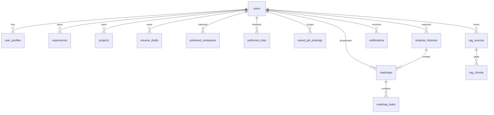

# DB 및 인증 설계서

이 문서는 JobFit Roadmap Agent 시스템의 데이터베이스(DB) 및 사용자 인증 설계에 대해 다룬다. 본 설계는 영속적인 데이터 보존과 사용자별 데이터 보호를 충족하기 위해 PostgreSQL 및 JWT 인증 아키텍처를 기반으로 한다.

---

## 1. 기술 선택 (Tech Stack)

* **Database**: PostgreSQL (버전 15 이상 권장)
  * 비정형 데이터 수집 및 히스토리 보존을 위한 `JSONB` 지원, 향후 시맨틱 검색 확장을 위한 `pgvector` 지원 우수성 고려.
* **ORM**: SQLAlchemy (버전 2.0 이상)
  * 비동기 데이터베이스 세션 지원 및 선언적 매핑(Declarative Mapping) 모델 구현.
* **Migration**: Alembic
  * DB 스키마 형상 관리를 관리하며, 버전 롤백 및 업그레이드 자동화 수행.
* **인증**: JWT (JSON Web Token) 기반 인증
  * 세션 저장소 독립적인 무상태(Stateless) 토큰 처리.
  * SHA-256 서명 키 및 `PyJWT` 또는 `python-jose` 라이브러리 사용.
* **비밀번호 암호화**: `bcrypt` 또는 `passlib[bcrypt]` 사용
  * 단방향 해시 알고리즘 기반 솔트(Salt) 추가 해싱 수행.

---

## 2. 주요 테이블 목록

1. **users**: 회원 가입 및 계정 정보 테이블
2. **user_profiles**: 사용자 프로필 기본 설정 테이블
3. **experiences**: 지원자 이력 및 경력 CRUD 테이블
4. **projects**: 이미 해본 프로젝트 CRUD 테이블
5. **resume_drafts**: 자기소개서 초안 및 기작성 구절 관리 테이블
6. **preferred_companies**: 사용자가 지정한 관심/목표 기업 테이블
7. **preferred_roles**: 사용자가 지정한 관심/목표 직무 테이블
8. **saved_job_postings**: 스크랩 또는 저장한 채용 공고 정보 테이블
9. **analysis_histories**: 사용자의 직무 매칭 분석 수행 결과 보관 테이블
10. **roadmaps**: 분석 기록에서 파생되어 가동되는 로드맵 메인 테이블
11. **roadmap_tasks**: 로드맵 내에 포진한 주차별 세부 할 일(Task) 테이블
12. **notifications**: 로드맵 및 스케줄 관련 앱 내부 알림 보관 테이블
13. **rag_sources**: RAG 임베딩/텍스트 원본 소스 정보 테이블
14. **rag_chunks**: RAG 검색용 텍스트 조각(Chunk) 저장 테이블

---

## 3. 테이블별 상세 필드 명세

### 3.1 users (사용자 기본 계정)
| 필드명 | 타입 | 설명 | Nullable | Index |
| :--- | :--- | :--- | :--- | :--- |
| id | UUID (or INT PK) | 고유 식별자 | False | PK |
| email | VARCHAR(255) | 이메일 주소 (로그인 계정 ID) | False | Unique |
| password_hash | VARCHAR(255) |bcrypt 단방향 암호화 해시 값 | False | - |
| name | VARCHAR(100) | 사용자 성명 | False | - |
| created_at | TIMESTAMP | 가입 시간 | False | - |
| updated_at | TIMESTAMP | 최종 갱신 시간 | False | - |

### 3.2 user_profiles (사용자 프로필 설정)
| 필드명 | 타입 | 설명 | Nullable | Index |
| :--- | :--- | :--- | :--- | :--- |
| id | UUID (or INT PK) | 고유 식별자 | False | PK |
| user_id | UUID (or INT FK) | users 테이블 외래키 | False | Unique |
| current_position | VARCHAR(150) | 현재 직무 또는 상태 | True | - |
| current_tech_stack | TEXT | 보유 중인 주요 스택 요약 | True | - |
| created_at | TIMESTAMP | 생성 시간 | False | - |
| updated_at | TIMESTAMP | 최종 갱신 시간 | False | - |

### 3.3 experiences (경험 기록)
| 필드명 | 타입 | 설명 | Nullable | Index |
| :--- | :--- | :--- | :--- | :--- |
| id | INT PK | 경험 고유 식별자 | False | PK |
| user_id | UUID (or INT FK) | 작성 사용자 외래키 | False | FK |
| title | VARCHAR(255) | 경험 요약 (예: 인턴십, 동아리 활동 등) | False | - |
| description | TEXT | 수행한 세부 활동 및 성과 기술 | False | - |
| start_date | DATE | 시작 시점 | True | - |
| end_date | DATE | 종료 시점 (진행 중인 경우 null) | True | - |
| created_at | TIMESTAMP | 생성 시간 | False | - |
| updated_at | TIMESTAMP | 최종 갱신 시간 | False | - |

### 3.4 projects (프로젝트 기록)
| 필드명 | 타입 | 설명 | Nullable | Index |
| :--- | :--- | :--- | :--- | :--- |
| id | INT PK | 프로젝트 고유 식별자 | False | PK |
| user_id | UUID (or INT FK) | 작성 사용자 외래키 | False | FK |
| title | VARCHAR(255) | 프로젝트명 | False | - |
| role | VARCHAR(150) | 담당 역할 | True | - |
| tech_stack | VARCHAR(255) | 사용한 핵심 기술 스택 리스트 | False | - |
| description | TEXT | 프로젝트 아키텍처 및 구현 성과 상세 | False | - |
| created_at | TIMESTAMP | 생성 시간 | False | - |
| updated_at | TIMESTAMP | 최종 갱신 시간 | False | - |

### 3.5 resume_drafts (자기소개서 초안)
| 필드명 | 타입 | 설명 | Nullable | Index |
| :--- | :--- | :--- | :--- | :--- |
| id | INT PK | 자소서 초안 식별자 | False | PK |
| user_id | UUID (or INT FK) | 작성 사용자 외래키 | False | FK |
| title | VARCHAR(255) | 문항 또는 서류 항목 제목 | False | - |
| content | TEXT | 자기소개서 본문 텍스트 | False | - |
| created_at | TIMESTAMP | 생성 시간 | False | - |
| updated_at | TIMESTAMP | 최종 갱신 시간 | False | - |

### 3.6 preferred_companies (관심 기업 설정)
| 필드명 | 타입 | 설명 | Nullable | Index |
| :--- | :--- | :--- | :--- | :--- |
| id | INT PK | 관심 기업 식별자 | False | PK |
| user_id | UUID (or INT FK) | 관심 등록한 사용자 외래키 | False | FK |
| company_name | VARCHAR(255) | 기업명 | False | Index |
| industry | VARCHAR(150) | 기업 산업 분야 정보 | True | - |
| job_posting_summary | TEXT | 해당 관심 기업의 대표 공고/소개 요약 | True | - |
| created_at | TIMESTAMP | 생성 시간 | False | - |

### 3.7 preferred_roles (관심 직무 설정)
| 필드명 | 타입 | 설명 | Nullable | Index |
| :--- | :--- | :--- | :--- | :--- |
| id | INT PK | 관심 직무 식별자 | False | PK |
| user_id | UUID (or INT FK) | 관심 등록한 사용자 외래키 | False | FK |
| role_name | VARCHAR(255) | 관심 직무명 (예: AI 백엔드 엔지니어) | False | Index |
| created_at | TIMESTAMP | 생성 시간 | False | - |

### 3.8 saved_job_postings (저장된 채용공고)
| 필드명 | 타입 | 설명 | Nullable | Index |
| :--- | :--- | :--- | :--- | :--- |
| id | INT PK | 저장 공고 식별자 | False | PK |
| user_id | UUID (or INT FK) | 저장한 사용자 외래키 | False | FK |
| company_name | VARCHAR(255) | 회사명 | False | - |
| job_title | VARCHAR(255) | 채용 공고 직무명 | False | - |
| content | TEXT | 공고 원문 텍스트 데이터 | False | - |
| url | VARCHAR(1000) | 수집 경로 또는 원문 주소 | True | - |
| created_at | TIMESTAMP | 저장 시점 | False | - |

### 3.9 analysis_histories (분석 수행 기록)
| 필드명 | 타입 | 설명 | Nullable | Index |
| :--- | :--- | :--- | :--- | :--- |
| id | INT PK | 분석 이력 식별자 | False | PK |
| user_id | UUID (or INT FK) | 분석 요청한 사용자 외래키 | False | FK |
| title | VARCHAR(255) | 분석 리포트 제목 (예: [회사명] 직무 적합도 리포트) | False | - |
| position | VARCHAR(255) | 분석 대상 직무명 | False | - |
| company_name | VARCHAR(255) | 분석 대상 회사명 | True | - |
| input_snapshot | JSONB | 당시 요청 파라미터 전체 스냅샷 백업 | False | - |
| result_json | JSONB | 분석 완료된 JopFitResult 최종 JSON 데이터 | False | - |
| mode | VARCHAR(50) | 분석 모드 ("mock" 또는 "llm") | False | - |
| created_at | TIMESTAMP | 분석 생성 시점 | False | Index |

### 3.10 roadmaps (로드맵)
| 필드명 | 타입 | 설명 | Nullable | Index |
| :--- | :--- | :--- | :--- | :--- |
| id | INT PK | 로드맵 고유 식별자 | False | PK |
| user_id | UUID (or INT FK) | 대상 사용자 외래키 | False | FK |
| analysis_id | INT FK | 원인 제공 분석 이력 외래키 | False | FK |
| target_company_id | INT FK | 대상 관심 기업 ID 연동 | True | FK |
| target_role | VARCHAR(255) | 목표 직무 | False | - |
| title | VARCHAR(255) | 로드맵 계획서 명칭 | False | - |
| duration_weeks | INT | 계획 총 주차 (4, 6, 8) | False | - |
| start_date | DATE | 프로젝트 시작 적용일 | True | - |
| status | VARCHAR(50) | 진행 상태 ("todo", "doing", "done", "abandoned") | False | - |
| created_at | TIMESTAMP | 생성 시간 | False | - |

### 3.11 roadmap_tasks (로드맵 할 일)
| 필드명 | 타입 | 설명 | Nullable | Index |
| :--- | :--- | :--- | :--- | :--- |
| id | INT PK | Task 식별자 | False | PK |
| roadmap_id | INT FK | 연결된 로드맵 외래키 | False | FK |
| week | INT | 계획 적용 주차 (1-indexed) | False | Index |
| title | VARCHAR(255) | 해당 주차 목표 | False | - |
| detail | TEXT | 주차별 진행상세 작업 및 가이드 내용 | False | - |
| due_date | DATE | 목표 기한일 | True | - |
| status | VARCHAR(50) | 진행 상태 ("todo", "doing", "done", "skipped") | False | Index |
| created_at | TIMESTAMP | 생성 시점 | False | - |
| updated_at | TIMESTAMP | 최종 업데이트 시점 | False | - |

### 3.12 notifications (앱 내부 알림)
| 필드명 | 타입 | 설명 | Nullable | Index |
| :--- | :--- | :--- | :--- | :--- |
| id | INT PK | 알림 고유 식별자 | False | PK |
| user_id | UUID (or INT FK) | 알림 수신 대상 사용자 외래키 | False | FK |
| content | TEXT | 알림 메시지 본문 | False | - |
| is_read | BOOLEAN | 수신 열람 여부 | False | Index |
| created_at | TIMESTAMP | 생성 시간 | False | - |

### 3.13 rag_sources (RAG 문서 원본)
| 필드명 | 타입 | 설명 | Nullable | Index |
| :--- | :--- | :--- | :--- | :--- |
| id | INT PK | 문서 식별자 | False | PK |
| user_id | UUID (or INT FK) | 문서 보유 사용자 외래키 (공통 시 Null) | True | FK |
| title | VARCHAR(255) | 가이드 문서 제목 | False | - |
| url | VARCHAR(1000) | 수집 URL 소스 (없을 시 Null) | True | - |
| content | TEXT | 수집 원문 전체 텍스트 | False | - |
| created_at | TIMESTAMP | 등록 시간 | False | - |

### 3.14 rag_chunks (RAG 청크 분할 데이터)
| 필드명 | 타입 | 설명 | Nullable | Index |
| :--- | :--- | :--- | :--- | :--- |
| id | INT PK | 청크 고유 식별자 | False | PK |
| source_id | INT FK | RAG 소스 문서 외래키 | False | FK |
| chunk_index | INT | 분할 순서 인덱스 | False | - |
| content | TEXT | 분할된 부분 문장 정보 | False | - |
| embedding_vector | VECTOR(1536) | pgvector 활용 임베딩 (추후 적용용) | True | - |
| created_at | TIMESTAMP | 등록 시간 | False | - |

---

## 4. ERD (Entity-Relationship Diagram)

아래 다이어그램은 데이터베이스 테이블 간의 연관 관계를 보여준다. (색상과 테마 스타일을 배제한 순수 Mermaid ERD 규격)

---

## 5. 사용자 인증 흐름 (Authentication Flow)

JWT 인증 처리는 다음과 같은 Stateless 순서로 수행된다.

1. **회원 가입 (`POST /api/auth/register`)**:
   * 사용자가 이메일, 패스워드, 이름을 전송한다.
   * 백엔드는 패스워드 검증을 거치고 `bcrypt`를 이용해 일방향 암호화 해시 값을 계산하여 `users.password_hash`에 적재한다.
2. **로그인 (`POST /api/auth/login`)**:
   * 사용자가 이메일 및 비밀번호를 전송한다.
   * 백엔드는 DB에 저장된 `password_hash` 값을 사용자가 입력한 평문 비밀번호와 대조(`bcrypt.checkpw` 등)한다.
   * 일치 시, 사용자 ID(`user_id`)를 `sub` 클레임으로 담고 만료 시간(`exp`)을 설정한 JWT Access Token을 생성하여 반환한다.
3. **토큰 활용 (Authorization Bearer Header)**:
   * 클라이언트는 발급받은 JWT 토큰을 로컬 변수/메모리에 유지한다.
   * 이후 모든 인증 필수 API 호출 시 `Authorization: Bearer <JWT_TOKEN>` 헤더를 포함하여 요청한다.
4. **사용자 식별 및 보안 정보 조회 (`GET /api/me`)**:
   * 전송된 JWT 토큰을 서버 단 미들웨어에서 해석하여 `user_id`를 검증하고 현재 인가된 사용자 레코드를 반환한다.
   * 요청 본문 파라미터 대신 인가된 JWT 데이터로부터 사용자의 고유 컨텍스트를 도출한다.

---

## 6. 보안 고려사항 (Security Guidelines)

* **비밀번호 평문 저장 금지**: 평문 비밀번호는 어떠한 경우에도 데이터베이스에 적재되거나 파일 및 내부 로그 파일로 출력되어서는 안 된다.
* **API Key 저장 배제**: 사용자가 요청 시 전송할 수 있는 임시 OpenAI API Key는 휘발성 세션(API Request Scope 메모리) 내에서 호출 처리에만 임시 적용되며, 테이블이나 파일 시스템에 기록 및 유지되어서는 안 된다.
* **사용자별 소유 데이터 격리**: 모든 CRUD 제어 및 히스토리 조회 시, SQL 조건절에 `WHERE user_id = :authorized_user_id`를 필수로 체인하여 자신이 소유하지 않은 리소스에 타인이 인가 토큰을 우회하여 접근하는 수평적 권한 상승(Horizontal Privilege Escalation)을 엄격히 방지한다.
