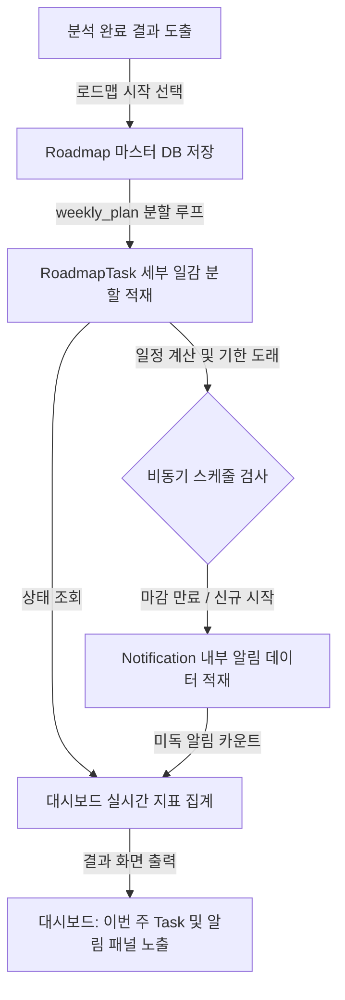

# Roadmap 및 알림 설계서

이 문서는 JobFit Roadmap Agent 분석 리포트 결과를 일회성 열람에 그치지 않고, 사용자가 직접 주차별 실천 현황을 기록/갱신하고 마일스톤에 맞게 실행을 추적할 수 있도록 돕는 로드맵 일감(Task) 관리 및 알림 서비스 설계서이다.

---

## 1. 목적 (System Purpose)

* **정적 리포트에서 일감(Task) 전환**: 분석 결과물에 포함된 추천 프로젝트 주차별 실천 계획(`weekly_plan`)을 개인 할 일 데이터베이스 레코드로 전환하여 상시 관리한다.
* **학습 유도 및 알림 피드백**: 주차별 마감 기한 도래 및 미진행 사항을 앱 내부 알림 시스템으로 리마인드하여 지속적인 취업/이직 준비 실천을 견인한다.

---

## 2. Roadmap 및 Task 저장 구조

분석 결과인 `JopFitResult`가 발급되면 사용자는 "로드맵 시작하기"를 선택할 수 있으며, 이와 동시에 데이터베이스에는 다음 구조로 마스터와 일감이 분할 저장된다.

### 2.1 로드맵 마스터 (`roadmaps`)
* 사용자의 특정 직무 분석 기록(`analysis_id`)과 연동된다.
* 준비 기간(`duration_weeks`) 및 로드맵 시작일(`start_date`)을 바탕으로 세부 일감들의 실질 마감일을 자동 계산하는 조율점 역할을 한다.

### 2.2 로드맵 주간 과제 (`roadmap_tasks`)
* 분석 응답의 `roadmap.weekly_plan` 배열을 주차 단위로 분할하여 개별 레코드로 적재한다.
* **주요 관리 필드**:
  * `week`: 분석된 주차 (예: 1주차, 2주차 등)
  * `title`: 해당 주차에 완료해야 할 주요 핵심 골(Goal)
  * `detail`: 로드맵에서 가이드라인으로 제시한 개발 구현 및 학습 세부 사항
  * `due_date`: `start_date`로부터 주차 수(Week * 7일)를 계산하여 자동으로 할당되는 과제 마감 기한
  * `status`: 현재 개별 할 일 상태

---

## 3. Task 상태 (Task Status)

주간 할 일의 진행 단계를 정교하게 추적하기 위해 다음 4가지 상태로 일람을 통제한다.

* **`todo` (진행 대기)**: 로드맵을 처음 시작했거나 아직 해당 주차 일정이 개시되지 않은 대기 상태.
* **`doing` (진행 중)**: 현재 주차의 범위에 도달하여 개발 및 학습이 활발히 진행 중인 상태.
* **`done` (완료)**: 주차별 세부 결과물 및 산출물을 완성하여 마일스톤을 달성한 상태.
* **`skipped` (건너뜀)**: 개인 사정에 의해 해당 주차 항목을 미수행 처리하고 다음 주차로 우회한 상태.

---

## 4. 알림 유형 및 발송 트리거 (Notification Types)

시스템은 비동기 작업 스케줄러(Cron) 및 사용자 행동을 감지하여 다음과 같은 내부 알림(`notifications`)을 자동으로 적재한다.

1. **이번 주 시작 알림 (Weekly Kickoff)**:
   * **트리거**: 매주 월요일 혹은 로드맵 주차 개시 당일.
   * **메시지 예**: "이번 주 [2주차: RAG 아키텍처 구현] 일정이 시작되었습니다. 상세 가이드를 대시보드에서 확인해 보세요!"
2. **마감 임박 알림 (Deadline Alert)**:
   * **트리거**: 주차 마감일(`due_date`) 2일 전까지 상태가 `done` 혹은 `skipped`로 갱신되지 않은 경우.
   * **메시지 예**: "[1주차: 개발 스펙 설계] 마감 기한이 2일 남았습니다. 진행 사항을 업데이트해 주세요."
3. **미완료 Task 알림 (Overdue Reminder)**:
   * **트리거**: 마감일(`due_date`)이 경과했음에도 상태가 여전히 `todo` 또는 `doing`인 경우.
   * **메시지 예**: "지난 [3주차] 과제 기한이 경과했습니다. 완료 처리하거나 진행도를 점검해 주십시오."
4. **관심 기업 기반 로드맵 제안 (Company-fit Suggestion)**:
   * **트리거**: 사용자가 새로운 관심 기업 또는 목표 채용 공고를 스크랩한 경우.
   * **메시지 예**: "새로 저장하신 [네이버] 공고 요건과 보유 스택을 비교하고 최신 맞춤 로드맵을 다시 진단해 보세요."
5. **자기소개서 업데이트 권장 알림 (Resume Update Warning)**:
   * **트리거**: 진행 중인 로드맵 Task를 2개 이상 `done` 처리하여 새로운 포트폴리오 산출물이 확보되었을 때.
   * **메시지 예**: "추천 프로젝트의 핵심 단계가 완료되었습니다. [자기소개서 반영 포인트]를 활용해 서류를 보완하세요."
6. **새로운 분석 이후 이전 로드맵 갱신 제안 (Re-sync Roadmap)**:
   * **트리거**: 진행 중인 로드맵이 있는 상태에서, 사용자가 다른 신규 공고 분석 리포트를 실행했을 경우.
   * **메시지 예**: "새로운 분석 결과가 등록되었습니다. 기존 로드맵 일정을 종료하고 새 직무에 맞춰 할 일을 갱신하시겠습니까?"

---

## 5. 대시보드 표시 항목 (Dashboard Indicators)

프론트엔드 로그인 이후 첫 메인 대시보드 화면에서는 다음 데이터 지표가 가시적으로 노출된다.

* **진행 중인 로드맵 수**: 현재 사용자가 `status = doing`으로 활성화하여 도전 중인 전체 마일스톤 갯수.
* **이번 주 Task**: 오늘 날짜 기준으로 마감 기한이 도래하는 이번 주 핵심 실천 가이드 목록.
* **미완료 Task**: 기한이 만료되었으나 아직 `done` 되지 않은 할 일 리스트.
* **최근 분석 기록**: 사용자가 그동안 실행했던 공고별 Fit-Gap 분석 기록 상위 5건.
* **관심 기업 목록**: 즐겨찾기에 등록된 기업들의 주요 역량 요건 요약 링크.
* **부족 역량 Top 5**: 이전 분석 이력들을 통계 내어, 사용자가 지원하려는 직무군 대비 공통적으로 가장 부족한 기술 스택(Gap) 테마 상위 5개 순위 표시.

---

## 6. 대시보드 일감 및 알림 처리 흐름 (Workflow Diagram)

분석 결과 도출 이후 최종 할 일이 적재되고 대시보드 지표 및 알림이 렌더링되기까지의 데이터 흐름도이다. (색상과 데코를 배제한 순수 Mermaid flowchart)

---

## 7. MVP 알림 구현 범위 및 제약조건

* **앱 내부 알림(In-App Notification) 우선**: 본 MVP 확장 개발 단계에서는 시스템의 빠른 개발과 빌드 경량화를 위해 **웹 서비스 데이터베이스 및 대시보드 화면상에 팝업/종 아이콘으로 뜨는 내부 알림 리스트만 구현**한다.
* **메시지 전송 매체 차단**: 외부 연동 API가 수반되는 이메일 발송 서버(SMTP/SES), 카카오톡 알림톡 API 연동, SMS 모듈 도입 및 Google Calendar 일정 자동 생성 등은 복잡성 제어를 위해 **MVP 범위에서 엄격히 제외**하며, 향후 2단계 개발(Phase 2) 영역으로 남겨둔다.
