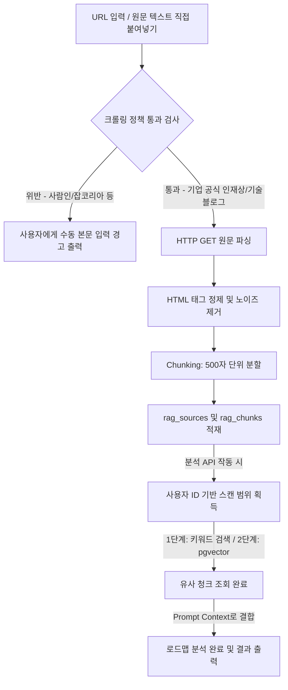

# URL 기반 RAG 설계서

이 문서는 사용자가 등록한 특정 채용공고의 URL 주소, 회사 직무 가이드 소개 페이지, 혹은 기업 인재상 정보 원문 텍스트를 수집하여 지식베이스로 정제하고, 로드맵 분석 단계에서 참고할 수 있도록 RAG(Retrieval-Augmented Generation) 인덱스를 빌드하는 URL RAG 모듈 설계서이다.

---

## 1. 목적 (System Purpose)

* **동적 지식 확장**: 고정 데이터 사전에 의존하는 대신, 사용자가 직접 제공한 목표 회사/직종의 최신 가이드를 RAG 소스로 주입하여 매칭 분석 품질을 개인화한다.
* **유연한 맥락 정보 제공**: 복사 및 붙여넣기가 불편한 긴 소개 페이지 정보를 직접 스크랩하여 백그라운드 지식으로 활용할 수 있게 한다.

---

## 2. MVP 접근 방식 및 설계 범위 제한

* **수집 및 저장 방식의 단순화**: 본 MVP 버전에서는 외부 차단 시스템 우회 등 불필요한 크롤링 엔진 고도화를 지양하며, **사용자가 직접 입력창에 URL 주소를 입력하거나, 스크랩이 차단된 경우 본문 텍스트를 통째로 붙여넣어 수동 등록하는 듀얼 하이브리드 입력 인터페이스**를 구축한다.
* **배치 격리**: URL 입력 시 백엔드에서 비동기로 요청을 보낸 뒤 가공된 결과 텍스트만 DB에 적재한다.

---

## 3. URL 수집 및 데이터 정제 파이프라인 (Data Pipeline)

RAG 적재는 아래 5단계 절차를 밟아 데이터베이스에 축적된다. (P2 확장 단계 예정)

1. **HTML 페이지 수집 (Request)**:
   * 사용자로부터 수신한 URL 주소로 HTTP GET 요청을 전송하여 raw HTML을 획득한다. (`httpx` 또는 `requests` 라이브러리 사용)
2. **콘텐츠 정제 및 노이즈 제거 (Parsing)**:
   * `BeautifulSoup`을 활용해 의미 없는 상단 헤더 메뉴 네비게이션바, 하단 푸터(주소 및 약관), 사이드 광고 배너 및 스크립트(`script`, `style`, `noscript`) 태그를 원천 배제한다.
   * 본문 알맹이(`article`, `main`, 혹은 주요 `div`) 텍스트만 고유 추출하여 여러 칸의 공백 문자열을 단일 공백으로 치환한다.
3. **가이드 텍스트 분할 (Chunking)**:
   * 추출된 전체 클린 텍스트 본문을 RAG 임베딩/검색 제한 토큰 길이에 맞춰 일정 크기(예: 500자 단위, Overlap 100자)의 텍스트 조각(Chunk)들로 슬라이싱 분할한다.
4. **원본 및 청크 DB 저장 (Persistence)**:
   * 원문 출처 및 메타데이터는 `rag_sources` 테이블에 저장한다.
   * 분할된 조각 텍스트들은 외래키(`source_id`)를 연결하여 `rag_chunks` 테이블에 일괄 적재한다.

---

## 4. 수집 시 주의사항 및 법적 제약 (Compliance Guidelines)

* **대표 채용 사이트 자동 크롤링 전면 차단**: 잡코리아, 사람인, 리크루팅 링커리어 등 국내 대형 채용 포털의 웹사이트는 약관 및 `robots.txt` 정책에 의해 기계적 데이터 긁어가기(Scraping)를 엄격히 금지하고 있다. 따라서 이러한 사이트의 URL을 분석 시도할 시 백엔드는 크롤러 가동을 즉시 정지하고 사용자에게 **"본문 내용을 복사하여 직접 입력해 주시기 바랍니다."** 에러 메시지를 노출하도록 설계한다.
* **로그인 요구 웹페이지 수집 제한**: 인증 세션이 필요한 개인 페이지, 사설 인트라넷 링크, 비밀글 성격의 페이지 주소 수집 시도는 HTTP 401/403 응답과 함께 가동이 차단된다.
* **소유권 기반 처리**: 사용자가 직접 명시적으로 공급한 공인된 기업 소개 및 직무 기술 블로그 URL 등을 주 대상으로 설정한다.

---

## 5. 사용자별 RAG 데이터 격리 (Data Isolation)

* **수평적 접근 분리**: `rag_sources` 및 `rag_chunks` 테이블은 `user_id` 외래키를 보유하여 사용자 소유를 강하게 보장한다.
* **검색 범위 리밋**: 특정 사용자가 로드맵 분석 API를 트리거했을 때, RAG 검색 스캔 범위는 오직 **(1) 시스템 공통 가이드 Markdown**과 **(2) 해당 유저(`user_id`)가 추가한 개인 스크랩 문서**로만 쿼리 대상을 필터링하여 정보 유출 및 크로스 검색을 원천 봉쇄한다.
* **관심 기업별 소스 격리**: 저장 시 `preferred_company_id`와 연계 가능하게 설계하여 특정 회사 전용 분석 시 타사 RAG 소스 텍스트는 조회 대상에서 제외한다.

---

## 6. 검색 아키텍처 점진적 진화 로드맵 (Evolution Phases)

RAG 검색 알고리즘은 시스템 부하 및 인프라 복잡성을 조율하기 위해 3단계에 걸쳐 진화한다.

* **1단계 (MVP/P0-P1): 키워드 매칭 검색**:
  * PostgreSQL의 내장 `LIKE` 절 또는 Full-Text Search 기능을 활용해 쿼리 키워드가 다수 매칭되는 순으로 청크를 조회한다.
  * 별도 벡터 변환 없이 빠른 조회가 가능하여 경량 DB 설계에 유리하다.
* **2단계 (P2): pgvector 기반 시맨틱 검색 (Semantic Search)**:
  * OpenAI 임베딩 API(Text-Embedding-3-Small 등)를 호출하여 텍스트 청크를 1536차원의 벡터로 변환하고 `rag_chunks.embedding_vector`에 보관한다.
  * DB 서버의 `pgvector` 코사인 유사도 거리 연산 연산자를 활용해 맥락과 의미 기반의 유사 문장을 추출한다.
* **3단계 (P2+): 하이브리드 검색 및 재정렬 (Hybrid Search & Reranking)**:
  * 1단계 키워드 매칭과 2단계 시맨틱 검색 스코어를 가중치 결합(RRF 등)하여 관련성이 가장 높은 최상위 청크를 다시 계산해 LLM의 컨텍스트로 전달한다.

---

## 7. RAG 적재 및 분석 연동 워크플로우 (Flowchart)

URL 등록 시점부터 분석에 소스로 주입되기까지의 흐름이다. (노드 색상과 스타일을 배제한 순수 Mermaid flowchart)

