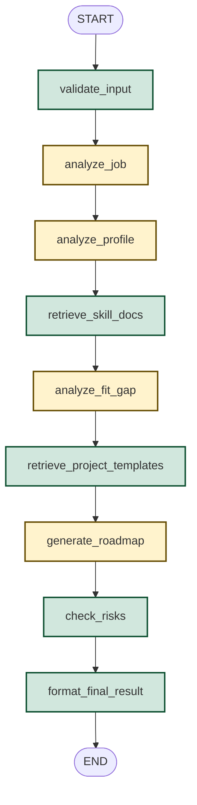

# WORKFLOW.md

# JopFit Roadmap Agent 워크플로우 정의서

이 문서는 JopFit Roadmap Agent MVP의 LangGraph StateGraph 워크플로우의 실행 제어 흐름, 개별 노드의 상태(State) 입출력 명세 및 실행 조건 분기를 기술한다.

> **이 문서를 기준으로 향후 코드를 수정한다.**

---

## 1. 전체 실행 흐름도 (Mermaid Diagram)

* **🟢 초록색 노드**: API 사용 유무와 무관하게 동작하는 **공통 로컬 연동 노드**
* **🟡 노란색 노드**: `state["use_llm"]` 플래그에 따라 **Mock 노드 또는 실제 LLM 노드로 동적 분기**되는 노드

---

## 2. 노드별 상태(State) 세부 제어 명세

각 노드는 공통 상태 객체인 `JopFitState`를 매개변수로 공급받고, 특정 속성을 읽고 갱신한 상태를 반환한다.

### 2.1 validate_input
* **형태**: 공통 노드
* **수행 내용**: 사용자가 화면에 입력한 필수 매개변수의 유효성(공백 유무)을 검출한다.
* **읽는 값 (Read)**: `user_input`
* **쓰는 값 (Write)**: `validation_errors`
* **에러 처리**: `validation_errors` 목록이 비어있지 않은 경우 워크플로우를 즉시 중단하고 `ValueError`를 송출한다.

### 2.2 analyze_job
* **형태**: 분기형 노드 (`node_analyze_job`)
* **동작 분기**:
  * `use_llm == False`: `analyze_job` 실행 (샘플 공고 및 요구사항 로딩)
  * `use_llm == True`: `analyze_job_llm` 실행 (OpenAI GPT API를 통한 공고 분석 및 근거 문구 원형 추출)
* **읽는 값 (Read)**: `user_input.position`, `user_input.job_posting`, `use_llm`
* **쓰는 값 (Write)**: `job_summary`, `extracted_requirements`

### 2.3 analyze_profile
* **형태**: 분기형 노드 (`node_analyze_profile`)
* **동작 분기**:
  * `use_llm == False`: `analyze_profile` 실행 (샘플 사용자 프로필 로딩)
  * `use_llm == True`: `analyze_profile_llm` 실행 (OpenAI GPT API를 통한 경험 매칭 목록 추출)
* **읽는 값 (Read)**: `user_input.resume_draft`, `user_input.project_description`, `user_input.tech_stack`, `use_llm`
* **쓰는 값 (Write)**: `user_summary`, `matched_experiences`

### 2.4 retrieve_skill_docs
* **형태**: 공통 노드
* **수행 내용**: 지원 직무와 채용공고의 첫 60글자, 보유 기술스택을 결합하여 1차 RAG 검색 쿼리를 형성하고 `docs/` 폴더 내 Markdown 문서를 매칭 점수 기반으로 검색한다.
* **읽는 값 (Read)**: `user_input.position`, `user_input.job_posting`, `user_input.tech_stack`
* **쓰는 값 (Write)**: `skill_docs`

### 2.5 analyze_fit_gap
* **형태**: 분기형 노드 (`node_analyze_fit_gap`)
* **동작 분기**:
  * `use_llm == False`: `analyze_fit_gap` 실행 (샘플 Fit-Gap 분석 데이터 매핑)
  * `use_llm == True`: `analyze_fit_gap_llm` 실행 (OpenAI GPT API에 직무 분석 결과 및 이력 요약 데이터를 넘겨 정교한 적합성 격차 판정 수행)
* **읽는 값 (Read)**: `job_summary`, `extracted_requirements`, `user_summary`, `matched_experiences`, `use_llm`
* **쓰는 값 (Write)**: `fit_gap_analysis`

### 2.6 retrieve_project_templates
* **형태**: 공통 노드
* **수행 내용**: Fit-Gap 결과에서 도출된 최우선순위 역량 강화 목록(`top_priorities`)과 희망 준비 주차 정보를 결합하여 2차 RAG 검색 쿼리를 형성하고 프로젝트 템플릿 Markdown을 검색 연동한다.
* **읽는 값 (Read)**: `fit_gap_analysis.top_priorities`, `user_input.desired_duration`
* **쓰는 값 (Write)**: `project_docs`

### 2.7 generate_roadmap
* **형태**: 분기형 노드 (`node_generate_roadmap`)
* **동작 분기**:
  * `use_llm == False`: `generate_roadmap` 실행 (선택 주차에 대응하는 샘플 프로젝트 개발 일정 로딩)
  * `use_llm == True`: `generate_roadmap_llm` 실행 (OpenAI GPT API에 Fit-Gap 결과 및 RAG로 검색된 참고 문서를 넘겨 가용 리소스 범위 내에 구현 가능한 커스텀 프로젝트 주차별 마일스톤 빌드)
* **읽는 값 (Read)**: `fit_gap_analysis`, `skill_docs`, `project_docs`, `user_input.desired_duration`, `user_input.weekly_hours`, `user_input.goal`, `use_llm`
* **쓰는 값 (Write)**: `roadmap`

### 2.8 check_risks
* **형태**: 공통 노드
* **수행 내용**: 사용자 이력 초안과 최종 제안된 주차별 마일스톤 텍스트 데이터를 받아 리스크 점검을 로컬 정규식 감사 코드로 수행한다.
* **읽는 값 (Read)**: `user_input`, `roadmap.weekly_plan`
* **쓰는 값 (Write)**: `risk_checks`

### 2.9 format_final_result
* **형태**: 공통 노드
* **수행 내용**: 파이프라인에서 수집/생성된 정보들을 취합하고, 프로그램 로직으로 `evidence_coverage_rate`를 공식에 대입하여 최종 JopFitResult 타입의 아웃풋 구조체를 구성한다.
  * **읽는 값 (Read)**: 이전 노드들에서 생성되어 상태에 보관 중인 모든 중간 데이터
  * **쓰는 값 (Write)**: `final_result`

---

## 3. 비동기 백그라운드 작업 및 알림 확장 설계 (Asynchronous Background Job & Notification)

대규모 상용 서비스 환경에서는 LLM 호출 및 다단계 LangGraph 아키텍처의 수행 시간이 수초에서 수십 초까지 소요될 수 있으므로, 동기식 HTTP 요청 차단(Blocking)을 방지하기 위해 다음과 같이 비동기 백그라운드 작업(Background Job)으로 처리 및 분리할 수 있습니다.

### 3.1 처리 프로세스 (Asynchronous Process Flow)

1. **분석 요청 접수 (Client -> Server)**:
   * 사용자가 '빈틈 찾기'를 요청하면, 백엔드는 즉시 작업 식별자(`task_id`)를 발급하고 HTTP 202 Accepted 응답을 반환합니다.
2. **백그라운드 작업 큐 등록 (Celery / Redis / FastAPI BackgroundTasks)**:
   * 실제 LangGraph 실행 루프는 비동기 백그라운드 워커(Worker)에 의해 비동기로 가동됩니다.
3. **상태 모니터링 (Polling / WebSocket)**:
   * 프론트엔드는 `task_id`를 기반으로 작업 진행 상태를 주기적으로 조회(Polling)하거나 WebSocket 채널을 통해 실시간으로 갱신 정보를 수신합니다.
4. **결과 알림 발송 (Notification Job)**:
   * 로드맵 분석 및 리스크 감사 절차가 최종 완수(`format_final_result` 통과)되면 알림 트리거가 백그라운드 워커에 의해 실행됩니다.
   * 등록된 이메일 또는 알림톡을 통해 **"JobFit 분석 리포트가 완료되었습니다."** 링크가 포함된 완성 메일을 발송합니다.
