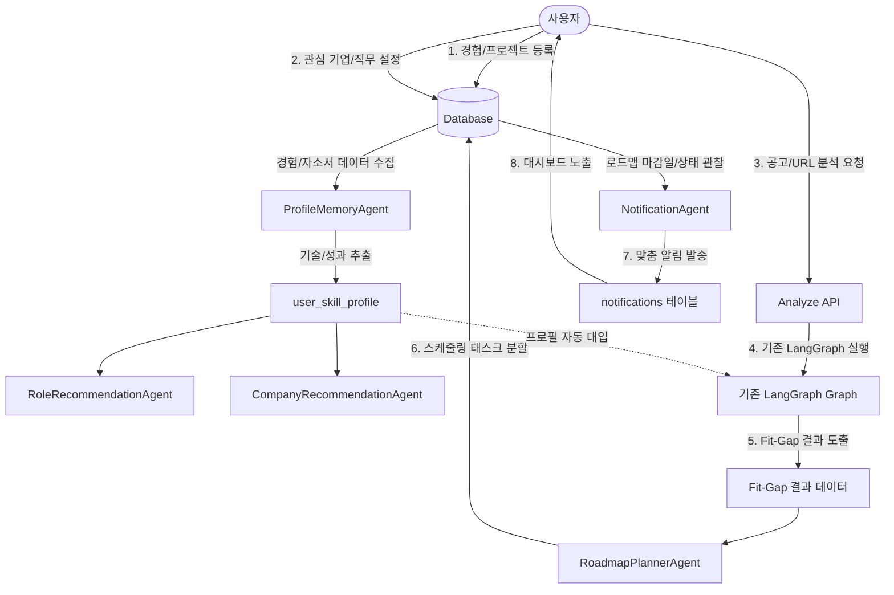

# Agent Workflow Design

## 1. 현재 Agent 구조
현재 JobFit Roadmap은 단일 채용공고와 단순 텍스트 프로필 간의 매칭 결과를 평가하기 위해 **LangGraph StateGraph** 기반의 워크플로우를 사용하고 있으며, 다음의 순서로 정해진 노드를 순차 처리합니다.

```
[시작] ──> validate_input ──> analyze_job ──> analyze_profile ──> retrieve_skill_docs 
           └──> analyze_fit_gap ──> retrieve_project_templates ──> generate_roadmap 
           └──> check_risks ──> format_final_result ──> [완료]
```

* **validate_input**: 사용자가 올바른 구조의 공고 및 프로필 입력을 주었는지 자료형 검증
* **analyze_job**: 입력받은 공고문에서 핵심 자격 요건(Requirements) 및 스택 추출
* **analyze_profile**: 제공된 프로필에서 보유 강점 및 핵심 경험 매핑
* **retrieve_skill_docs**: 공고 기술과 연관된 참고 스택 매뉴얼 또는 DB 내 자료 매치
* **analyze_fit_gap**: 추출된 요건과 이력을 대조하여 강점(Fit) 및 보완점(Gap) 연산
* **retrieve_project_templates**: 부족한 경험을 채우기 위한 템플릿화된 가이드 프로젝트 로드
* **generate_roadmap**: 주차별 맞춤 보완 학습/프로젝트 로드맵 생성
* **check_risks**: 생성된 로드맵의 난이도가 과도하게 높거나 실현 불가능한 부분이 있는지 크리틱(Critic) 검증
* **format_final_result**: `JopFitResult` 규격으로 최종 구조화 데이터 반환

---

## 2. 확장 Agent 구조 및 역할
사용자 중심의 이력 누적 관리 서비스로 확장하기 위해, 기존의 일회성 분석 그래프 외에 개별 특화 임무를 띤 **신규 Agent 군(Cohort)**을 도입하여 기능을 모듈화합니다.

```
                       ┌─────────────────────────┐
                       │   ProfileMemoryAgent    │
                       └────────────┬────────────┘
                                    │ user_skill_profile
            ┌───────────────────────┼───────────────────────┐
            ▼                       ▼                       ▼
┌───────────────────────┐ ┌───────────────────────┐ ┌───────────────────────┐
│RoleRecommendationAgent│ │CompanyRecommendAgent  │ │ RoadmapPlannerAgent   │
└───────────────────────┘ └───────────────────────┘ └───────────┬───────────┘
                                                                │ roadmap
                                                                ▼
                                                    ┌───────────────────────┐
                                                    │   NotificationAgent   │
                                                    └───────────────────────┘
```

### 2.1 ProfileMemoryAgent
* **목적**: 사용자가 저장/수정한 단편적인 경험, 프로젝트, 자기소개서 초안을 분석하여 유기적인 전체 역량 스냅샷을 작성하고 메모리로 요약 유지합니다.
* **입력**: 사용자가 작성한 `experiences` 목록, `projects` 목록, `resume_drafts` 목록
* **처리**: 
  - 각 소스에서 기술 태그, 주요 문제해결 경험, 기여도 성과 지표 추출
  - 단순 키워드 매칭을 넘어 사용자의 '종합 실무 성숙도 레벨'을 텍스트로 요약 및 구조화
* **출력**: `user_skill_profile` (구조화된 통합 역량 메모리 프로필)

### 2.2 RoleRecommendationAgent
* **목적**: 사용자의 종합 역량 메모리를 타깃 직무의 시장 트렌드와 비교하여 맞춤 추천 및 격차 분석을 수행합니다.
* **입력**: `user_skill_profile` (ProfileMemoryAgent 출력), 사용자가 설정한 `preferred_roles` 리스트, 과거 `analysis_histories`
* **처리**:
  - 설정 직무별 연관 스택 가중치를 매칭하여 적합도 백분율 스코어 연산
  - 해당 직무를 지원하기 위해 우선적으로 제거해야 하는 Gap(부족 역량) 도출
* **출력**: 추천 직무 목록, 매칭 근거 보고서, 집중 보완 필요 역량 리스트

### 2.3 CompanyRecommendationAgent
* **목적**: 사용자가 선호하는 관심 기업군의 특성과 사용자의 프로젝트/경험 데이터를 비교하여 입사 준비를 위한 커스터마이징 전략을 제공합니다.
* **입력**: `user_skill_profile`, 설정한 `preferred_companies`, 선호 산업군
* **처리**:
  - 기업들의 인재상, 기술 지향점(예: 고부하 트래픽 대응 vs 빠르게 출시하는 MVP), 비즈니스 도메인을 분석
  - 사용자의 경험이 해당 기업에서 매력적으로 보일 수 있도록 매핑 및 포지셔닝 제안
* **출력**: 추천 기업 유형 리스트, 관심 기업별 최적 준비 행동 방향 및 보강해야 할 포트폴리오 아이템

### 2.4 RoadmapPlannerAgent
* **목적**: 채용공고의 실시간 요구 사항과 개인 프로필 간의 격차(Gap) 분석 결과를 토대로, 가용한 기간 내에 현실적으로 실행할 수 있는 상세 세부 실행 스케줄러로 계획을 설계합니다.
* **입력**: Fit-Gap 분석 원형 결과, 목표 타깃 직무, 선호 관심 기업, 설정한 준비 기간(주 단위)
* **처리**:
  - 보완해야 할 Gap 요소를 준비 기간 주차(week) 수에 맞춰 순차적(Sequence) 배열
  - 각 주차의 목표를 구체적인 검증 가능 수치(예: "Docker Container 구동 검증")로 구체화하여 개별 과제(Task)로 분할
* **출력**: `roadmap` 메타데이터 및 세부 `weekly_tasks` 리스트

### 2.5 NotificationAgent
* **목적**: 사용자의 대시보드 상태와 로드맵 진행 상태를 모니터링하여 맞춤형 행동 유도 메시지를 생성합니다.
* **입력**: 활성화된 `roadmaps`, 연관 `roadmap_tasks` 리스트, 이전 `analysis_histories` 갱신 여부
* **처리**:
  - 일요일 자정/월요일 아침 배치 트리거 시, 활성화된 로드맵의 다음 주차 Task를 분석하여 격려 문구 생성
  - 기한 초과 Task 방치 시 경고 알림 작성 및 신규 공고 분석 시 이전 로드맵과 겹치는 내용 비교하여 갱신 추천
* **출력**: 수신 대상 `user_id`, 알림 제목, 알림 바디 텍스트, 카테고리 태그 및 대시보드 이동용 딥링크 주소

### 2.6 UrlRagIngestionAgent (P2 / RAG 확장형)
* **목적**: 사용자가 제공한 공고 URL 또는 타깃 기업 홈페이지 텍스트를 RAG에 활용 가능한 지식 청크 단위로 분해하고 분석에 바인딩합니다.
* **입력**: 사용자가 입력한 채용공고 URL 또는 원본 텍스트 본문
* **처리**:
  - HTML 태그 정제 및 노이즈 텍스트(Header, Footer, CSS) 제거
  - 텍스트 크기에 맞게 토큰 단위로 청킹(Chunking)을 실행하고 사용자의 RAG Context에 바인딩
* **출력**: 생성된 `rag_source` 메타정보 및 분절된 `rag_chunks` 리스트

---

## 3. 서비스 통합 Mermaid 워크플로우



---

## 4. Mock / LLM 모드 작동 방식
시스템은 개발 과정에서의 비용 절감 및 빠른 프론트엔드 테스트를 위해 **Mock 모드**와 **LLM 호출 모드**의 듀얼 아키텍처를 철저히 고수합니다.

* **Mock Mode (기본 활성화)**
  - LLM API를 실제로 트리거하지 않고, 사전에 정의된 정적 템플릿(JSON)에서 랜덤하거나 고정된 값을 채워 즉각 리턴합니다.
  - ProfileMemoryAgent 및 추천 Agent 군은 사전에 설정된 더미 역량 프로필과 하드코딩된 직무 추천서(`Backend: 90%`, `Frontend: 60%` 등)를 반환하도록 설계합니다.
* **LLM Mode (개발자 옵션)**
  - `.env`에 설정된 `LLM_MODE=true` 및 유효한 OpenAI API Key 감지 시 동작합니다.
  - 프롬프트를 구성하여 실제 모델(예: `gpt-4o-mini` 등)로 텍스트/JSON API를 송수신합니다.
  - 추천 Agent들의 경우, 초기 성능 확보 전까지는 **Rule-Based 로직** (특정 카테고리와 스택 태깅의 개수로 연산)을 우선 실행하고, 필요시에만 LLM에 최종 텍스트 요약 작성을 Optional하게 요청하는 하이브리드 구조를 권장합니다.

---

## 5. 향후 LangGraph 통합 방안
* **분산 그래프 관리(Decoupled Graphs)**: 기존의 공고 분석 그래프(`analyze_graph`)는 기존 구조와 호환성을 보장하기 위해 절대 수정하지 않고 고립시킵니다.
* **추천 그래프 신설**: 직무/기업 추천을 전담하는 별도의 그래프(`recommendation_graph`)를 LangGraph 내에 추가적으로 선언하여, 메인 분석 스레드와 트래픽 충돌 없이 독립적으로 컴파일 및 배포될 수 있도록 구축합니다.
* **백그라운드 비동기 처리**: `NotificationAgent`에 의한 주기적인 알림 배치 생성은 API 트래픽 성능 저하를 방지하기 위해 LangGraph 워크플로우에 결합하지 않고, 백엔드 프레임워크(FastAPI BackgroundTasks 또는 Celery Task)에 배치 형태로 분리 위임합니다.
