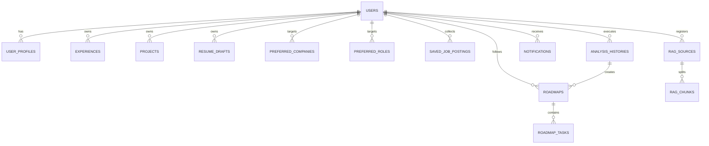

# DB 및 인증 설계서

## 1. 기술 선택
* **DBMS**: PostgreSQL (사용자별 복잡한 관계형 데이터 쿼리 및 JSONB 타입을 통한 유연한 분석 데이터 스냅샷 저장 지원)
* **ORM**: SQLAlchemy (Python 진역의 대표적인 SQL Toolkit 및 Object-Relational Mapper)
* **마이그레이션 도구**: Alembic (SQLAlchemy 모델 정의 변경에 따른 순차적 DB 스키마 버전 관리)
* **인증 스키마**: JWT (JSON Web Token) 기반 Access Token 인증 방식 (Stateless 기반 API 요청 인증)
* **보안 암호화**: `bcrypt` 또는 `passlib` 패키지를 활용한 일방향 비밀번호 해싱 (`password_hash` 필드 저장)

---

## 2. 주요 테이블 목록
1. **users**: 기본적인 가입 계정 정보를 저장합니다.
2. **user_profiles**: 이름, 연락처, 희망 연봉 등 사용자의 프로필 메타데이터를 저장합니다.
3. **experiences**: 사용자의 개별 직무 경험(동아리, 교육, 인턴 등)을 관리합니다.
4. **projects**: 사용자가 수행한 상세 프로젝트 정보 및 기술 스택을 기록합니다.
5. **resume_drafts**: 사용자가 작성해 둔 자기소개서 문항 및 답변 초안을 보관합니다.
6. **preferred_companies**: 사용자가 타깃으로 하는 관심 기업 정보를 저장합니다.
7. **preferred_roles**: 사용자가 희망하는 관심 직무군을 저장합니다.
8. **saved_job_postings**: 관심 기업 또는 직무와 연계하여 사용자가 수집한 채용공고의 원본 본문을 보관합니다.
9. **analysis_histories**: 사용자가 실행한 채용공고 Fit-Gap 분석의 스냅샷 및 결과 JSON을 기록합니다.
10. **roadmaps**: AI 분석 결과를 통해 도출하여 활성화된 목표별 개인 로드맵의 마스터 레코드입니다.
11. **roadmap_tasks**: 주차별로 생성된 로드맵의 실천 과제 To-Do 아이템들입니다.
12. **notifications**: 사용자에게 발송된 대시보드 인앱 알림을 기록합니다.
13. **rag_sources**: (P2/RAG 확장용) 사용자가 RAG 목적으로 입력한 외부 문서 또는 URL 원본 메타데이터입니다.
14. **rag_chunks**: (P2/RAG 확장용) RAG 텍스트를 청킹하여 임베딩 및 검색이 가능하도록 저장하는 테이블입니다.

---

## 3. 테이블별 상세 필드 설계

### 3.1 users (사용자 계정 테이블)
| 필드명 | 타입 | 설명 | Nullable | Index |
| :--- | :--- | :--- | :---: | :---: |
| `id` | UUID | 사용자 고유 식별자 (PK) | No | PK |
| `email` | VARCHAR(255) | 로그인용 이메일 주소 | No | Unique |
| `password_hash` | VARCHAR(255) | bcrypt 해싱 처리된 비밀번호 | No | No |
| `created_at` | TIMESTAMP | 계정 생성 일시 (UTC) | No | No |
| `updated_at` | TIMESTAMP | 계정 수정 일시 (UTC) | No | No |

### 3.2 user_profiles (사용자 프로필 테이블)
| 필드명 | 타입 | 설명 | Nullable | Index |
| :--- | :--- | :--- | :---: | :---: |
| `id` | UUID | 프로필 식별자 (PK) | No | PK |
| `user_id` | UUID | 연관 사용자 식별자 (FK -> users.id) | No | FK, Unique |
| `name` | VARCHAR(100) | 사용자 실명 또는 닉네임 | No | No |
| `current_job_title` | VARCHAR(100) | 현재 직무 / 학생 상태 등 | Yes | No |
| `total_experience_months` | INTEGER | 총 경력 기간 (월 단위) | No | No |
| `created_at` | TIMESTAMP | 등록 일시 (UTC) | No | No |
| `updated_at` | TIMESTAMP | 수정 일시 (UTC) | No | No |

### 3.3 experiences (경험 저장소 테이블)
| 필드명 | 타입 | 설명 | Nullable | Index |
| :--- | :--- | :--- | :---: | :---: |
| `id` | UUID | 경험 식별자 (PK) | No | PK |
| `user_id` | UUID | 소유 사용자 식별자 (FK -> users.id) | No | FK |
| `title` | VARCHAR(200) | 경험 항목명 (예: '멋쟁이사자처럼 10기') | No | No |
| `category` | VARCHAR(50) | 경험 분류 (예: 'activity', 'education', 'internship') | No | Yes |
| `start_date` | DATE | 시작 년월일 | No | No |
| `end_date` | DATE | 종료 년월일 (진행 중일 경우 Null) | Yes | No |
| `description` | TEXT | 경험 상세 설명 및 수행 내용 | No | No |
| `skills_gained` | JSONB | 해당 경험에서 획득한 기술/소프트 역량 태그 리스트 | Yes | No |
| `created_at` | TIMESTAMP | 등록 일시 (UTC) | No | No |
| `updated_at` | TIMESTAMP | 수정 일시 (UTC) | No | No |

### 3.4 projects (프로젝트 상세 테이블)
| 필드명 | 타입 | 설명 | Nullable | Index |
| :--- | :--- | :--- | :---: | :---: |
| `id` | UUID | 프로젝트 식별자 (PK) | No | PK |
| `user_id` | UUID | 소유 사용자 식별자 (FK -> users.id) | No | FK |
| `title` | VARCHAR(200) | 프로젝트 명칭 | No | No |
| `role` | VARCHAR(100) | 담당 역할 (예: 'Main Back-end Dev') | No | No |
| `tech_stack` | JSONB | 사용한 기술 스택 태그 (예: `["FastAPI", "PostgreSQL"]`) | No | No |
| `description` | TEXT | 프로젝트 전체 소개 및 해결한 문제 정의 | No | No |
| `contribution` | TEXT | 본인의 주요 기여 내용 및 아키텍처 상의 개선점 | No | No |
| `outcomes` | TEXT | 정량적/정성적 성과 (예: '응답속도 30% 개선') | Yes | No |
| `project_url` | VARCHAR(255) | 깃허브 또는 배포 URL 링크 | Yes | No |
| `created_at` | TIMESTAMP | 등록 일시 (UTC) | No | No |
| `updated_at` | TIMESTAMP | 수정 일시 (UTC) | No | No |

### 3.5 resume_drafts (자기소개서 초안 테이블)
| 필드명 | 타입 | 설명 | Nullable | Index |
| :--- | :--- | :--- | :---: | :---: |
| `id` | UUID | 자소서 식별자 (PK) | No | PK |
| `user_id` | UUID | 소유 사용자 식별자 (FK -> users.id) | No | FK |
| `title` | VARCHAR(200) | 자소서 파일명 또는 제출 대상 명칭 | No | No |
| `question` | TEXT | 자기소개서 질문 문항 | No | No |
| `answer` | TEXT | 작성한 답변 본문 | No | No |
| `target_company` | VARCHAR(100) | 제출 예정 기업명 (선택) | Yes | Yes |
| `created_at` | TIMESTAMP | 등록 일시 (UTC) | No | No |
| `updated_at` | TIMESTAMP | 수정 일시 (UTC) | No | No |

### 3.6 preferred_companies (관심 기업 테이블)
| 필드명 | 타입 | 설명 | Nullable | Index |
| :--- | :--- | :--- | :---: | :---: |
| `id` | UUID | 관심 기업 식별자 (PK) | No | PK |
| `user_id` | UUID | 설정 사용자 식별자 (FK -> users.id) | No | FK |
| `company_name` | VARCHAR(100) | 기업명 (예: 'Toss') | No | Yes |
| `industry` | VARCHAR(100) | 산업군 분류 | Yes | No |
| `memo` | TEXT | 해당 기업에 대한 관심 이유 등 개인 메모 | Yes | No |
| `created_at` | TIMESTAMP | 등록 일시 (UTC) | No | No |

### 3.7 preferred_roles (관심 직무 테이블)
| 필드명 | 타입 | 설명 | Nullable | Index |
| :--- | :--- | :--- | :---: | :---: |
| `id` | UUID | 관심 직무 식별자 (PK) | No | PK |
| `user_id` | UUID | 설정 사용자 식별자 (FK -> users.id) | No | FK |
| `role_name` | VARCHAR(100) | 직무명 (예: 'Python Backend Developer') | No | Yes |
| `priority` | INTEGER | 우선순위 순번 (1순위, 2순위 등) | No | No |
| `created_at` | TIMESTAMP | 등록 일시 (UTC) | No | No |

### 3.8 saved_job_postings (저장된 채용공고 테이블)
| 필드명 | 타입 | 설명 | Nullable | Index |
| :--- | :--- | :--- | :---: | :---: |
| `id` | UUID | 공고 식별자 (PK) | No | PK |
| `user_id` | UUID | 저장 사용자 식별자 (FK -> users.id) | No | FK |
| `company_name` | VARCHAR(100) | 공고 등록 기업명 | No | Yes |
| `position_title` | VARCHAR(200) | 채용 직무명 | No | No |
| `job_url` | VARCHAR(255) | 공고 웹 링크 | Yes | No |
| `raw_text` | TEXT | 수집된 공고 텍스트 전체 본문 | No | No |
| `deadline` | DATE | 지원 마감 기한 (상시 채용일 경우 Null) | Yes | Yes |
| `created_at` | TIMESTAMP | 등록 일시 (UTC) | No | No |

### 3.9 analysis_histories (공고 분석 기록 테이블)
| 필드명 | 타입 | 설명 | Nullable | Index |
| :--- | :--- | :--- | :---: | :---: |
| `id` | UUID | 분석 기록 식별자 (PK) | No | PK |
| `user_id` | UUID | 실행 사용자 식별자 (FK -> users.id) | No | FK |
| `title` | VARCHAR(200) | 분석서 요약 제목 (예: '토스 백엔드 공고 분석') | No | No |
| `position` | VARCHAR(100) | 분석 대상 직무 | No | No |
| `company_name` | VARCHAR(100) | 분석 대상 기업명 | No | Yes |
| `input_snapshot` | JSONB | 분석 시점의 프로필/공고 입력 데이터 스냅샷 | No | No |
| `result_json` | JSONB | 분석 결과로 도출된 Fit-Gap/로드맵 JSON 전체 데이터 | No | No |
| `mode` | VARCHAR(20) | 실행 모드 (`mock` 또는 `llm`) | No | No |
| `created_at` | TIMESTAMP | 분석 실행 및 완료 일시 (UTC) | No | Yes |

### 3.10 roadmaps (맞춤 로드맵 마스터 테이블)
| 필드명 | 타입 | 설명 | Nullable | Index |
| :--- | :--- | :--- | :---: | :---: |
| `id` | UUID | 로드맵 식별자 (PK) | No | PK |
| `user_id` | UUID | 대상 사용자 식별자 (FK -> users.id) | No | FK |
| `analysis_id` | UUID | 근간이 된 분석 이력 식별자 (FK -> analysis_histories.id) | No | FK |
| `target_company` | VARCHAR(100) | 목표 대상 기업명 | Yes | No |
| `target_role` | VARCHAR(100) | 목표 대상 직무 | No | No |
| `title` | VARCHAR(200) | 로드맵 제목 | No | No |
| `duration_weeks` | INTEGER | 로드맵 전체 계획 주차 (기본값 4) | No | No |
| `start_date` | DATE | 로드맵 시작 설정 일자 | No | No |
| `status` | VARCHAR(20) | 진행 상황 상태 (`active`, `completed`, `abandoned`) | No | Yes |
| `created_at` | TIMESTAMP | 생성 일시 (UTC) | No | No |

### 3.11 roadmap_tasks (로드맵 세부 과제 테이블)
| 필드명 | 타입 | 설명 | Nullable | Index |
| :--- | :--- | :--- | :---: | :---: |
| `id` | UUID | 과제 식별자 (PK) | No | PK |
| `roadmap_id` | UUID | 상위 로드맵 식별자 (FK -> roadmaps.id) | No | FK |
| `week` | INTEGER | 과제 수행 목표 주차 (예: 1주차 -> 1, 2주차 -> 2) | No | Yes |
| `title` | VARCHAR(255) | 과제 명칭 (To-Do 요약) | No | No |
| `detail` | TEXT | AI가 가이드라인으로 제안한 실천 과제 내용 | No | No |
| `due_date` | DATE | 과제 마감 목표 일자 | Yes | Yes |
| `status` | VARCHAR(20) | 과제 상태 (`todo`, `doing`, `done`, `skipped`) | No | Yes |
| `created_at` | TIMESTAMP | 생성 일시 (UTC) | No | No |
| `updated_at` | TIMESTAMP | 수정 일시 (UTC) | No | No |

### 3.12 notifications (대시보드 알림 테이블)
| 필드명 | 타입 | 설명 | Nullable | Index |
| :--- | :--- | :--- | :---: | :---: |
| `id` | UUID | 알림 식별자 (PK) | No | PK |
| `user_id` | UUID | 수신 사용자 식별자 (FK -> users.id) | No | FK |
| `title` | VARCHAR(200) | 알림 제목 요약 | No | No |
| `message` | TEXT | 알림 세부 메시지 내용 | No | No |
| `category` | VARCHAR(50) | 알림 분류 (예: 'task_deadline', 'system_recommend') | No | Yes |
| `link_url` | VARCHAR(255) | 클릭 시 이동할 화면의 내부 라우트 경로 | Yes | No |
| `is_read` | BOOLEAN | 읽음 처리 상태 여부 | No | Yes |
| `created_at` | TIMESTAMP | 알림 생성 일시 (UTC) | No | Yes |

### 3.13 rag_sources (RAG 원본 메타데이터 테이블)
| 필드명 | 타입 | 설명 | Nullable | Index |
| :--- | :--- | :--- | :---: | :---: |
| `id` | UUID | 소스 식별자 (PK) | No | PK |
| `user_id` | UUID | 업로드 사용자 식별자 (FK -> users.id) | No | FK |
| `source_type` | VARCHAR(50) | 소스 유형 (예: 'url', 'direct_paste') | No | No |
| `source_name` | VARCHAR(255) | 문서 제목 또는 원본 URL 주소 | No | No |
| `raw_content` | TEXT | 필터링 및 전처리를 거친 추출 텍스트 원본 | No | No |
| `created_at` | TIMESTAMP | 등록 일시 (UTC) | No | No |

### 3.14 rag_chunks (RAG 조각 텍스트 테이블)
| 필드명 | 타입 | 설명 | Nullable | Index |
| :--- | :--- | :--- | :---: | :---: |
| `id` | UUID | 청크 식별자 (PK) | No | PK |
| `source_id` | UUID | 소유 원본 문서 식별자 (FK -> rag_sources.id) | No | FK |
| `user_id` | UUID | 격리를 위한 사용자 식별자 (FK -> users.id) | No | FK |
| `chunk_index` | INTEGER | 문서 내 청크 순번 | No | No |
| `text_content` | TEXT | 분할된 조각 본문 텍스트 | No | No |
| `created_at` | TIMESTAMP | 생성 일시 (UTC) | No | No |

---

## 4. ERD Mermaid 다이어그램



---

## 5. 인증 흐름 (Auth Flow)

인증은 상태 비저장 방식(Stateless)인 JWT 기반의 토큰 구조를 채택하여 동작합니다.

```
[클라이언트]                              [API 서버]
    │                                         │
    ├─ 1. POST /api/auth/register ───────────>│ (회원 가입 처리, 비밀번호 해싱)
    │  <─ 2. 응답: 회원가입 성공 ──────────────┤
    │                                         │
    ├─ 3. POST /api/auth/login ──────────────>│ (이메일/비밀번호 대조 및 JWT 생성)
    │  <─ 4. 응답: JWT Access Token ──────────┤
    │                                         │
    ├─ 5. GET /api/me ───────────────────────>│ (Header: Authorization Bearer [Token])
    │                                         │ (Token 서명 검증 및 사용자 식별)
    │  <─ 6. 응답: User 및 Profile JSON ───────┤
    │                                         │
    ├─ 7. GET /api/experiences ──────────────>│ (Header: Authorization Bearer [Token])
    │                                         │ (user_id 필터 추가하여 자기 데이터만 조회)
    │  <─ 8. 응답: 해당 사용자 경험 리스트 ────┤
```

* **회원가입**: 클라이언트가 제공한 비밀번호는 서버 도달 즉시 bcrypt 단방향 해시를 거친 후 `password_hash`로 users 테이블에 삽입됩니다.
* **로그인**: 이메일 존재 여부 체크 후, DB의 해시된 암호와 입력받은 일반 텍스트 암호의 해시 일치성을 대조합니다. 일치 시 토큰 만료 기한 및 `user_id`를 Claim에 내포한 JWT 토큰을 발급합니다.
* **Authorization Header**: 이후 로그인 검증이 요구되는 모든 API 호출 시 클라이언트는 HTTP Header에 `Authorization: Bearer <JWT_TOKEN>`을 담아 발송합니다.
* **사용자별 데이터 접근 제한**: 컨트롤러 단에서 토큰의 유효성을 디코딩하여 추출한 `user_id`를 검출하고, DB 쿼리 실행 시 `WHERE user_id = :authenticated_user_id` 조건을 필수로 주입하여 자신의 정보에만 접근 가능하도록 엄격히 통제합니다.

---

## 6. 보안 고려사항 (Security Considerations)
* **비밀번호 안전성 확보**: DB 내에 비밀번호 원본 텍스트(Plain Text)를 절대 로깅하거나 기록하지 않으며, 인증 검증 시 단방향 솔트 적용 해시 비교 로직만 제공합니다.
* **API Key 노출 예방**: 서버의 글로벌 환경변수에 OpenAI API Key 및 기타 민감한 보안 키를 바인딩하여 백엔드 레벨에서만 처리하도록 하고, 클라이언트에는 절대로 보안 키가 유출되지 않도록 합니다. 만약 개발자/사용자 개별 API Key 입력 기능을 제공할 경우에는 해당 Key를 DB에 저장하지 않고, 분석 요청 시 클라이언트 메모리에서 HTTPS Header를 통해 API 호출 인자로 일회성 전달하여 사용한 뒤 폐기하는 구조를 택합니다.
* **수평적 권한 상승(Horizontal Privilege Escalation) 방지**: `/api/analyses/{analysis_id}` 등 상세 리소스를 수정/삭제/조회하는 모든 요청에 대해, 해당 리소스의 소유자(`user_id`)가 JWT 상의 현재 요청자와 정확히 부합하는지를 인터셉터 또는 DB 데코레이터 단에서 상시 체크하여 타인의 데이터 탈취 시도를 차단합니다.
