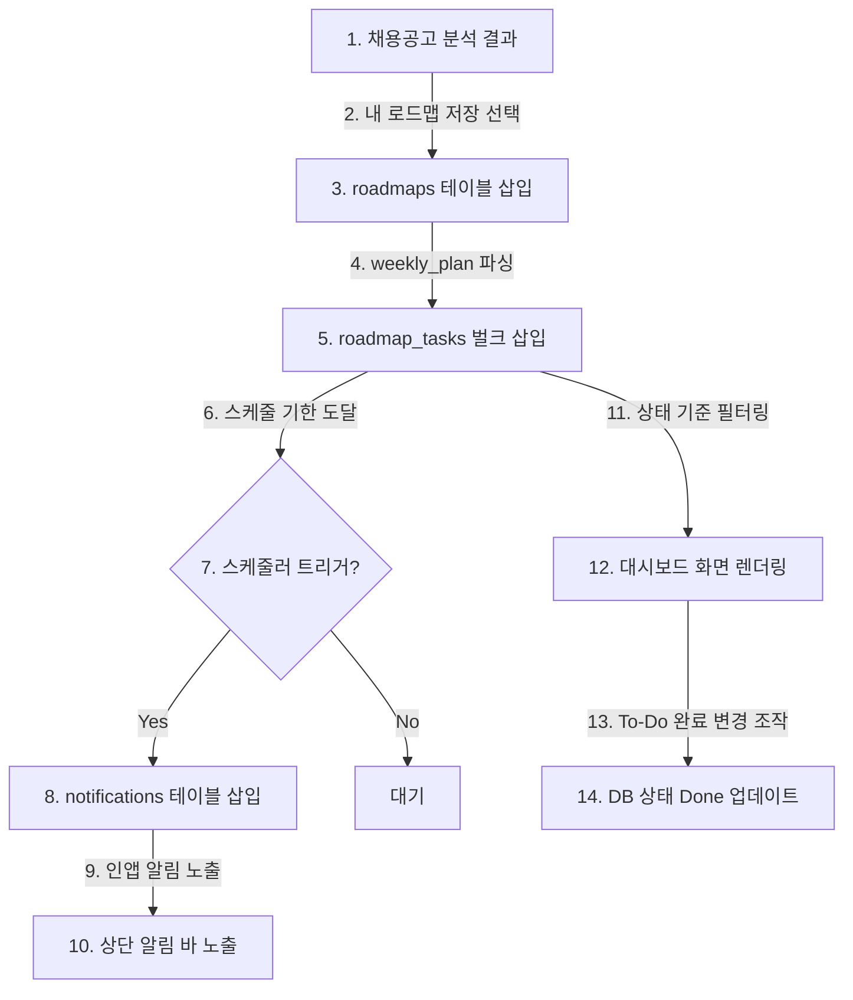

# Roadmap 및 알림 설계서

## 1. 목적
기존의 채용공고 분석 시스템은 "보완해야 할 역량"을 단순 줄글 보고서 형태로만 피드백하여, 사용자가 실제 행동으로 옮기기 전 흐지부지되는 한계가 있었습니다. 
본 설계는 AI가 찾아낸 부족 역량(Gap)과 로드맵 제안을 데이터베이스 기반의 **개별 주차별 실행 과제(RoadmapTask)**로 변환하고, **앱 내부 알림(Notification)**과 **메인 대시보드**를 통해 구직자가 매일매일 취업 준비 진척 상황을 가시적으로 트래킹할 수 있는 행동 유도형(Actionable) 시스템을 구축하는 것을 목적으로 합니다.

---

## 2. Roadmap 저장 및 Task 변환 구조
사용자가 AI 분석 상세 화면에서 '로드맵 활성화' 또는 '내 로드맵으로 저장'을 선택할 때, 시스템은 다음과 같이 마스터 로드맵 레코드와 주차별 실천 과제를 연계 생성합니다.

```
[AI 분석 완료] ──> 분석 결과 내 "roadmap" 확인
                      │
                      ▼ (사용자가 저장 버튼 선택 시)
[마스터 로드맵 생성] (roadmaps 테이블 레코드 1건 삽입)
                      │
                      ▼ (weekly_plan 루프 동작)
[세부 과제 리스트 생성] (weekly_plan 요소를 풀어 roadmap_tasks에 N건 벌크 삽입)
```

### 2.1 매핑 예시
분석 결과 JSON 내 `roadmap.weekly_plan` 배열에 아래와 같은 데이터가 있는 경우:
```json
{
  "week": 1,
  "goal": "Docker 기본 숙지 및 로컬 컨테이너 배포",
  "detail": "공식 튜토리얼을 완수하고, 기존 캡스톤 프로젝트 서버를 컨테이너화하여 로컬 실행 검증"
}
```
시스템은 `roadmap_tasks` 테이블에 다음과 같이 매핑하여 삽입합니다.
* `roadmap_id`: 생성된 `roadmaps.id` (UUID)
* `week`: `1` (INTEGER)
* `title`: `"Docker 기본 숙지 및 로컬 컨테이너 배포"` (VARCHAR)
* `detail`: `"공식 튜토리얼을 완수하고, 기존 캡스톤 프로젝트 서버를 컨테이너화하여 로컬 실행 검증"` (TEXT)
* `due_date`: 로드맵 시작일(`start_date`)로부터 `(week * 7) - 1` 일 뒤로 자동 연산하여 대입
* `status`: `"todo"` (VARCHAR, 기본값)

---

## 3. Task 상태 전이 모델
로드맵 과제는 사용자의 조작에 따라 다음과 같은 상태(Status) 흐름을 가집니다.

```
        ┌─────────────┐
        │    todo     │ (과제 생성 시 초기 상태)
        └──────┬──────┘
               │
               ▼
        ┌─────────────┐
        │    doing    │ (사용자가 준비 시작 버튼 클릭 시)
        └──────┬──────┘
               │
       ┌───────┴───────┐
       ▼               ▼
 ┌───────────┐   ┌───────────┐
 │   done    │   │  skipped  │
 └───────────┘   └───────────┘
(수행 완료 상태)  (선택적 패스/불필요 시 제외)
```

* **todo**: 준비 예정 상태.
* **doing**: 현재 활성화되어 진행 중인 학습/개발 단계.
* **done**: 작성이 완료되었거나 학습이 끝나 확인 완료된 상태.
* **skipped**: 본인에게 이미 친숙한 내용이거나 공고 요건 변경 등의 사유로 이번 로드맵에서 배제한 과제.

---

## 4. 알림 유형 및 트리거 조건

### 4.1 이번 주 시작 알림 (Weekly Kickoff Notification)
* **목적**: 주차의 시작 시점에 이번 주에 달성해야 할 목표를 상기시킵니다.
* **트리거**: 매주 로드맵 시작 요일(예: 월요일) 아침 09:00에 배치가 감지하여 자동 생성.
* **문구 예시**: `"[JobFit] 이번 주 2주차 과제를 시작할 시간입니다: 'Spring Security 커스텀 필터링 최적화'에 도전해 보세요!"`

### 4.2 마감 임박 알림 (Deadline Alert)
* **목적**: 기한이 얼마 남지 않은 과제의 수행을 독려합니다.
* **트리거**: 상태가 `todo` 또는 `doing`인 과제 중 `due_date`가 현재 날짜로부터 1일 전인 과제를 매일 저녁 18:00에 스캔하여 생성.
* **문구 예시**: `"[마감 안내] 'Docker 컨테이너화' 태스크 마감이 하루 남았습니다. 진척도를 기록해 주세요."`

### 4.3 미완료 과제 알림 (Overdue Reminder)
* **목적**: 마감일이 지났으나 아직 완료되지 않은 상태를 점검하도록 유도합니다.
* **트리거**: `due_date` < `TODAY` 이며 상태가 `done` 또는 `skipped`가 아닌 과제 검출 시 매주 화요일 아침 발송.
* **문구 예시**: `"[리마인더] 1주차에 미완료된 태스크 1건이 남아있습니다. 학습 상태를 조정해 보세요."`

### 4.4 관심 기업 기반 로드맵 제안 (Recommended Action)
* **목적**: 관심 기업으로 지정해 둔 곳에서 신규 채용공고가 감지되었거나, 해당 기업 맞춤 분석을 오랫동안 실행하지 않은 경우 분석을 유도합니다.
* **트리거**: 관심 기업 등록일로부터 14일 경과 시점 혹은 타깃 기업 공고 저장 데이터 입력 시.
* **문구 예시**: `"[JobFit 제안] 관심 기업인 '토스'의 백엔드 직무 맞춤 분석을 실행하고 최신 준비 로드맵을 설계해 보세요."`

### 4.5 자소서 업데이트 필요 알림 (Resume Freshness Alarm)
* **목적**: 등록된 자기소개서의 최신화 상태를 보증합니다.
* **트리거**: `resume_drafts` 테이블의 최종 수정일(`updated_at`)이 30일 경과한 경우.
* **문구 예시**: `"[프로필 관리] 자기소개서 초안을 업데이트한 지 30일이 지났습니다. 그동안 쌓은 프로젝트 성과를 추가해 보세요."`

### 4.6 새로운 분석 이후 이전 로드맵 갱신 제안 (Roadmap Version Up)
* **목적**: 최신 역량 프로필이나 공고를 기반으로 새로운 분석을 마쳤을 때, 구형 로드맵을 대체하도록 유도합니다.
* **트리거**: 동일 직무/기업에 대해 최신 분석이 추가 완료된 시점.
* **문구 예시**: `"[로드맵 업데이트] 새로운 Fit-Gap 분석이 감지되었습니다. 이전 로드맵을 최신 AI 분석 결과 기반으로 변경하시겠습니까?"`

---

## 5. 대시보드 화면 설계 요건
사용자가 로그인한 후 메인 대시보드에서 조회할 핵심 정보 컴포넌트 목록은 다음과 같습니다.

1. **진행 중인 로드맵 현황**
   - 현재 활성화된 로드맵 제목, 전체 주차 대비 현재 주차 표시, 남은 기간 등.
2. **이번 주 태스크 리스트 (Weekly Tasks)**
   - `due_date`가 이번 주에 걸쳐 있는 `roadmap_tasks` 목록 노출 및 즉각적인 토글 체크박스(`todo` <-> `done` 전환).
3. **미완료 태스크 요약 (Overdue Tracker)**
   - 마감 기한이 지난 과제들의 개수와 목록을 별도 적색 태그 등으로 시각화.
4. **최근 분석 히스토리 숏컷 (Recent Analysis)**
   - 최근 3건의 분석 기록(기업명, 직무, 분석일시) 및 상세 페이지 바로가기 링크.
5. **관심 기업 및 공고 매핑 리스트**
   - 설정한 관심 기업 목록과 최근 등록한 공고 상태 표시.
6. **부족 역량 Top 5 (Focus Gap Area)**
   - 여러 분석서의 `gap_aspects` 데이터를 종합 집계하여 가장 자주 지적받은 취약 기술 태그 Top 5를 차트/배지 형태로 표시 (예: 1위 Docker, 2위 Redis...).

---

## 6. 데이터 흐름 다이어그램 (Workflow)



---

## 7. MVP 알림 범위 (Scope)
* **인앱 알림 전용**: 본 MVP에서는 **애플리케이션 웹 내부 대시보드 및 상단 알림 벨 영역**을 통한 리스트 제공만 개발 범위로 한정합니다.
* **외부 전송 배제**: 사용자 기기 푸시(Push Notification), 외부 Google Calendar 양방향 API 동기화, 이메일 발송, 문자 및 알림톡 등 외부 API 서비스 연동은 MVP 단계에서는 제외하며, P1/P2 단계에서 도입합니다.
