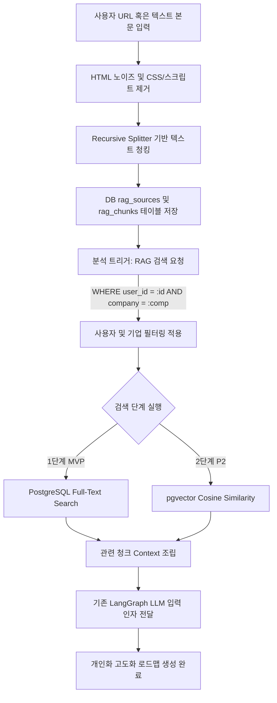

# URL 기반 RAG 설계서

## 1. 목적
기존의 고정된 이력 분석을 넘어, 구직자가 지원하려는 특정 기업의 채용공고 상세 페이지(예: 원티드 공고), 공식 인재상 소개 웹사이트, 혹은 관련 블로그 직무 인터뷰 아티클 등 정성적 텍스트 데이터를 분석 엔진에 동적으로 제공하여 **개인 맞춤형 Fit-Gap 분석서와 로드맵의 정확도를 획득하기 위한 RAG(검색 증강 생성) 파이프라인 설계**입니다.

---

## 2. MVP 접근 방식
웹 사이트들의 잦은 UI 변경 및 봇 차단(Bot Blocking) 보안 조치, 크롤링 법적 제약을 우려하여, 본 MVP 및 초기 단계에서는 다음과 같은 단계적/우회적 접근 방식을 제안합니다.

1. **텍스트 직접 붙여넣기(Direct Paste) 우선 지원**
   - 크롤링 실패 및 스크래핑 제약에 무관하게 동작하도록, 사용자가 웹페이지 텍스트 전체를 복사하여 텍스트 영역(TextArea)에 직접 입력하는 양식을 기본 제공합니다.
2. **단순 HTTP Scraper (P2 단계 점진 구현)**
   - 백그라운드 크롤링 데몬(Cron)을 구현하지 않고, 사용자가 URL 입력창에 주소를 적고 [내용 가져오기] 버튼을 누른 시점에 동기식(또는 FastAPI BackgroundTasks)으로 단일 HTTP 요청을 보내 정적 HTML을 파싱하는 간단한 스크래퍼만 구비합니다.

---

## 3. URL 수집 및 데이터 처리 파이프라인 (P2 기능)

```
[URL 입력] ──> [HTTP Request] ──> [HTML DOM 파싱] ──> [텍스트 추출 & 정제]
                                                              │
[RAG 검색 활용] <── [데이터베이스 저장] <── [청킹(Chunking)] <───────┘
```

1. **URL 접근**: 파이썬 `httpx` 또는 `requests` 라이브러리를 활용하여 대상 주소로 GET 요청을 전송합니다. 사용자 브라우저 접속으로 보이도록 표준 User-Agent 헤더를 설정합니다.
2. **HTML 본문 추출**: `BeautifulSoup4` 및 `html2text`를 사용하여 순수 텍스트 영역을 분리합니다.
3. **노이즈(Noise) 제거**: HTML의 `<nav>`, `<footer>`, `<header>`, `<script>`, `<style>`, 광고 배너 등의 마크업 요소를 파싱 트리 상에서 완전히 제거하여 공고 본문과 무관한 텍스트 찌꺼기를 필터링합니다.
4. **텍스트 정제(Text Cleaning)**: 연속된 줄바꿈 개행문자, 특수기호, 중복 공백 등을 단일 공백으로 치환하여 압축합니다.
5. **청킹(Chunking)**: LLM의 Context Window 한계 극복 및 정확한 조각 검색을 위해, `RecursiveCharacterTextSplitter`를 도입하여 500~800자 단위(Overlap: 100자 내외)로 텍스트를 조각냅니다.
6. **DB 영속화**: 원본 메타데이터는 `rag_sources`에 저장하고, 쪼개진 텍스트 조각들은 `rag_chunks` 테이블에 일관되게 적재합니다.

---

## 4. 법적 및 기술적 주의사항
* **robots.txt 준수**: 스크래핑 실행 전 해당 도메인의 `/robots.txt` 경로를 체크하여 크롤링 비허용 정책이 명시되어 있는 경우 스크래핑을 즉각 중단하고 사용자에게 텍스트 직접 입력 양식으로 우회하도록 얼럿(Alert)을 표시합니다.
* **로그인 장벽 페이지 스킵**: 세션 및 인증이 필요한 사내 시스템, 유료 회원 전용 페이지, 캡차(CAPTCHA) 솔루션이 걸려 있는 페이지는 우회 시도를 원천 배제합니다.
* **사용자 귀책 원칙**: 시스템이 선제적으로 외부 사이트를 스캐닝하는 방식은 취하지 않으며, 전적으로 로그인한 사용자가 요청 시점에 명시적으로 제출한 URL/텍스트에 한해서만 처리하는 폐쇄형 구조를 준수합니다.

---

## 5. 사용자별 RAG 격리 구조 (Multi-tenant RAG)
사용자가 등록한 정보는 타인의 자소서 분석에 인용되는 등의 혼선이 없도록 데이터 레이어에서 완벽히 논리적 격리를 수행해야 합니다.

```
       [RAG 검색 쿼리 수행]
                │
         ( user_id 검증 )
                │
  ┌─────────────┴─────────────┐
  ▼                           ▼
[User A 전용 Documents]    [User B 전용 Documents]
 - rag_sources (User A)     - rag_sources (User B)
 - rag_chunks  (User A)     - rag_chunks  (User B)
```

* **user_id 조건 한정**: `rag_sources` 및 `rag_chunks` 테이블에 저장 시 현재 세션의 `user_id`를 강제 매핑합니다.
* **관심 기업별 Context 분리**: 분석 시점에 사용자가 설정한 대상 기업명(`company_name`)이 있을 경우, 쿼리에 `AND company_name = :company_name` 필터를 덧붙여 해당 기업 관련으로 저장한 RAG 소스 청크들만 선별 조회하도록 통제합니다.

---

## 6. 검색 아키텍처 진화 로드맵 (Search Evolution)

### 1단계: RDB 풀텍스트 및 키워드 매칭 (MVP 규격)
* **내용**: pgvector 등 추가적인 확장 프로그램 설치가 불가능한 초기 단계에서 사용합니다.
* **방식**: PostgreSQL의 `tsvector` 내장 풀텍스트 검색(Full-text Search) 기능을 활용하거나, 분석에 필요한 핵심 역량 키워드 리스트를 바탕으로 `ILIKE` 키워드 매칭을 실행하여 관련성 높은 청크를 가져옵니다.

### 2단계: Vector Embedding 기반 시맨틱 검색 (P2 확장)
* **내용**: 문맥상의 의미적 유사도가 높은 자료를 검색에 반영합니다.
* **방식**: PostgreSQL에 `pgvector` 확장을 활성화합니다. `text-embedding-3-small` 등의 임베딩 모델로 청크의 벡터값을 계산한 뒤, 사용자의 프로필 질문에 대해 Cosine Similarity(코사인 유사도) 쿼리를 수행하여 Top-K 청크를 추출합니다.

### 3단계: 하이브리드 검색 및 재정렬 (Hybrid Search & Re-rank)
* **내용**: 키워드 기반의 정확한 명사 매칭과 의미적 매칭의 장점을 결합합니다.
* **방식**: 1단계의 Keyword BM25 결과와 2단계의 Vector 유사도 점수를 상호역순순위(RRF: Reciprocal Rank Fusion) 알고리즘으로 병합하고, Cohere Re-ranker 등을 추가 적용하여 LLM 컨텍스트에 주입할 청크의 우선순위를 최종 보정합니다.

---

## 7. Mermaid 데이터 흐름도


